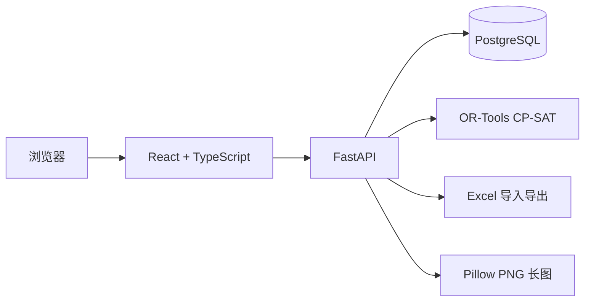

# DNF 团长排表工具

面向 DNF 国服 PC 端团长的人员管理与智能排表网站。项目通过版本化副本配置定义人数、队伍和分队规则，再结合玩家可用波次、角色强度及特殊角色标签自动生成多波排表。

> 当前状态：阶段 5 公网化工程基线已完成。项目已具备完整业务闭环、多账号权限、单编辑会话、Caddy 自动 HTTPS、生产环境强校验、备份恢复演练，以及 Playwright 浏览器闭环和 1/12/30/50 波性能回归；当前工作以现有 12 人团本流程的稳定性、实际使用反馈、易用性优化和正式上线准备为主。

## 当前工作重点与长期 TODO

当前不再按新的产品阶段连续扩张功能，围绕现有 12 人团本集中推进两条主线：

- **紧凑型 UI/UX**：采用 Apple 风格的系统字体、中性背景、蓝色交互强调、轻量层次和紧凑控件，让同一屏幕展示更多排表信息，同时保留清晰的状态和操作反馈。
- **智能排表升级**：严格区分完整度、前置填充、3C1奶、秘宝 C、跨波平衡、队伍强度和玩家偏好的优先级，并在生成结果中展示可解释的质量指标。
- **自然语言排表规则（设计完成，待实现）**：使用 DeepSeek v4 解析“本次排表要求”，经结构化预览和团长确认后再由确定性编译器交给 OR-Tools；长期规则仍归属于版本化副本配置。

稳定性修复、真实团长数据验证和生产上线准备继续作为两条主线的基础工作；只有在真实反馈或性能数据支持时才扩展其他功能。

军团本人工分组和互带规则仅保留为长期 TODO，目前不作为重点工作，也没有排期。其他长期 TODO 包括多人实时协作、玩家自助报名、动态评分公式、实战数据校正，以及评估让 DeepSeek 生成仅供 OR-Tools 参考的初始提示解。

## 核心能力

- **副本管理**：Owner/Editor 可维护副本基础信息，为新副本创建首个草稿，并通过结构化编辑器配置默认波数、任意数量队伍、每队人数、合法组成、强度顺序、秘宝 C、跨波平衡和空位策略；支持版本校验、发布、复制、历史查看和退役，已发布版本保持不可变。
- **人员管理**：按玩家和职业维护参团角色，不录入角色名和备注；同一玩家职业唯一，支持手动录入、九列 Excel 批量导入，以及玩家和角色两级拖拽排序并持久化。确认导入后按 Excel 行顺序排列人员和角色，未出现在表格中的既有数据保持相对顺序并置于其后，同时保留秘宝、固定红队奶与群猎标记。
- **智能排表**：根据角色次数、玩家可用波次、C 伤害、奶增益量和秘宝 C 自动排队。
- **人工微调**：支持拖拽、交换、锁定、撤销恢复和局部重新生成。
- **版本历史**：发布不可变排表快照，支持复制旧排表开启全新次数周期。
- **分享导出**：支持可过期、可撤销的只读链接，以及 PNG 长图、Excel 和纯文本；草稿导出强制显示水印。
- **账号安全**：Owner 管理多账号和审计记录，Editor 可编辑业务数据，Viewer 仅允许读取；写请求使用会话绑定 CSRF 令牌，登录失败按账号和来源限流。
- **单编辑会话**：进入排表时申请独立租约并自动续期；其他会话只读查看，租约过期后可接管，写操作仍同时校验 revision。

## 默认 12 人团本规则

系统将内置一个 12 人团本副本版本：

| 规则 | 默认值 |
| --- | --- |
| 默认波数 | 12，可动态增减 |
| 每波人数 | 12 |
| 队伍 | 红、黄、绿三队 |
| 每队人数 | 4 |
| 优先组成 | 3C1奶 |
| 备用组成 | C 不足且奶富余时允许 2C2奶 |
| 特殊角色 | 每波一个秘宝 C，进入红队 |
| 队伍强度 | 红队 ≥ 黄队 ≥ 绿队 |
| 跨波目标 | 各波总体实力尽量接近 |
| 空位策略 | 优先填满前面的波次 |

同一角色在一张排表中最多使用一次；同一玩家在同一波最多使用一个角色，但可以在不同波使用不同角色。

## 可扩展副本模型

人数和队伍规则不会写死在页面或求解器中。每个副本通过不可变版本定义：

- 队伍数量、名称、颜色、顺序和人数。
- 每支队伍允许的角色组成及优先级。
- 特殊角色的标签、数量和目标队伍。
- 队伍强度顺序、跨波平衡和待补策略。
- 默认波数、允许波数范围和评分公式版本。

排表绑定具体副本版本，因此发布新副本规则不会改变旧排表或历史导出。该模型可以表达单队 4 人等结构；军团本人工互带工作流仅作为长期 TODO 保留，不属于当前重点或已排期版本。

## 技术架构



| 层级 | 技术 |
| --- | --- |
| 前端 | React、TypeScript、Vite、Ant Design、dnd-kit |
| 后端 | FastAPI、Pydantic、SQLAlchemy、Alembic |
| 智能排表 | OR-Tools CP-SAT |
| 数据库 | PostgreSQL |
| Excel | openpyxl |
| 长图 | Pillow |
| 部署 | Docker Compose |
| 测试 | pytest、Vitest、Playwright、隔离 Docker/PostgreSQL 冒烟与恢复测试 |

MVP 采用模块化单体架构，不引入 Redis、消息队列或微服务。开发阶段在本机通过 Docker Compose 运行，生产环境通过 Caddy 和 Compose 叠加配置部署到公网服务器。

## 项目文档

- [需求设计文档](docs/design.md)：产品范围、业务规则、页面流程和验收标准。
- [技术设计文档](docs/technical-design.md)：系统架构、PostgreSQL、API、求解器、测试和部署方案。
- [生产部署与数据恢复](docs/deployment.md)：HTTPS、生产配置、备份、恢复、升级和日常运维。
- [阶段 5 性能基线](docs/performance-baseline.md)：1/12/30/50 波求解结果、浏览器和全栈验收范围。
- [12 人团本质量基线](docs/raid-quality-baseline.md)：典型人员短缺、秘宝、锁定和玩家冲突场景的量化门槛。

当前文档版本均为 v0.2。

## 快速开始

### 环境要求

- Node.js 24、pnpm 11。
- Python 3.12、uv。
- Docker Desktop（包含 Docker Compose）。

首次启动：

```bash
make bootstrap
make up
```

`make bootstrap` 会在 `.env` 不存在时从 `.env.example` 创建本地配置，并按锁文件安装依赖。`make up` 会构建并后台启动 PostgreSQL、API 和 Web；API 容器会自动执行 Alembic 迁移和幂等种子。

启动后可访问：

- Web：<http://localhost:5173>
- API 文档：<http://localhost:8000/docs>
- 存活探针：<http://localhost:8000/api/v1/health/live>
- 就绪探针（检查 PostgreSQL）：<http://localhost:8000/api/v1/health/ready>

本地示例账号由 `.env` 中的 `BOOTSTRAP_OWNER_USERNAME` 和
`BOOTSTRAP_OWNER_PASSWORD` 幂等初始化。示例值为 `admin / change-me-now`，首次用于实际数据前请修改密码；公网环境不得使用示例凭据。
本地 Compose 默认会在登录页展示并预填这组账号；设置
`VITE_SHOW_DEV_LOGIN=false` 后重新构建 Web 即可关闭，公网环境必须关闭。

Owner 登录后可从“账号与审计”创建 Editor 或 Viewer，并查看最近写操作与登录结果。
`LOGIN_RATE_LIMIT_ATTEMPTS`、`LOGIN_RATE_LIMIT_SOURCE_ATTEMPTS`、
`LOGIN_RATE_LIMIT_WINDOW_SECONDS` 和 `LOGIN_RATE_LIMIT_LOCK_SECONDS` 分别控制账号来源
组合、单一来源的登录失败阈值、统计窗口及封禁时间；过期限流记录会自动清理。前端会自动把可读的
`dnf_csrf` Cookie 作为 `X-CSRF-Token` 请求头发送；会话 Cookie 始终保持 HttpOnly。
`EDIT_LOCK_LEASE_SECONDS` 和 `EDIT_LOCK_HEARTBEAT_SECONDS` 控制排表编辑租约；默认
90 秒租期、30 秒心跳。租约令牌仅在当前浏览器标签页的 `sessionStorage` 中保存，
服务端只保存哈希。

常用命令：

```bash
make test          # 后端 pytest + 前端 Vitest
make check         # 静态检查、前后端、全栈恢复、性能及浏览器完整验收
make test-stack    # 验证迁移、种子、编辑、发布、导出、鉴权和反向代理
make test-e2e      # 在隔离容器栈上运行 Playwright Chromium 闭环
make test-performance # 运行显式 1/12/30/50 波性能基线
make test-quality  # 运行 12 人团本质量场景并输出 JSON 指标
make solver-poc    # 运行默认 12 波团本和自定义单队 4 人 CP-SAT PoC
make migrate       # 本机对 DATABASE_URL 执行数据库迁移
make seed          # 幂等写入内置 12 人团本及评分公式
make init-owner    # 交互式创建首个 Owner（未使用环境变量时提示输入）
make logs          # 跟踪三个容器日志
make down          # 停止容器，保留 PostgreSQL 数据卷
make prod-config   # 校验 .env.production 和生产 Compose 叠加配置
make prod-up       # 通过 Caddy HTTPS 启动生产容器
make backup        # 生成 PostgreSQL 自定义格式备份
make restore BACKUP_FILE=/path/to/backup.dump  # 显式恢复生产数据库
```

本地 `.env` 中的 `DATABASE_URL` 供宿主机命令使用，连接 `localhost`；`CONTAINER_DATABASE_URL` 供 API 容器使用，连接 Compose 服务名 `db`。两者的用户名、密码和数据库名必须与 PostgreSQL 配置保持一致；用于公网环境前必须替换示例密码。数据库端口只绑定到 `127.0.0.1`。

不使用 Docker 时，可以分别启动开发服务：

```bash
pnpm dev
cd backend && uv run uvicorn app.main:app --reload
```

## 开发进度

- [x] 需求梳理
- [x] 技术设计
- [x] 副本扩展模型
- [x] 初始化 React、FastAPI 和 Docker Compose 工程
- [x] 建立首批副本 PostgreSQL Schema、迁移和种子
- [x] 完成 OR-Tools 阶段 0 算法 PoC
- [x] 建立 Owner 登录和服务端会话
- [x] 开发副本版本、人员管理及 Excel 导入基础闭环
- [x] 建立排表、参团快照、玩家偏好、波次、队伍和位置 Schema
- [x] 完成排表创建/复制、波数调整、参团选择和角色快照同步
- [x] 完成玩家波次偏好、结构化预检查和只读空排表编辑器
- [x] 开发 OR-Tools 自动排表、锁定保留、求解诊断和生成记录
- [x] 开发拖拽编辑器、发布版本、只读分享和多格式导出
- [x] 完善发布预检、历史版本预览/复制、分享管理和草稿水印导出
- [x] 完成多账号、Owner/Editor/Viewer 权限、CSRF、登录限流和审计基线
- [x] 完成单编辑会话锁、心跳、超时接管和 Viewer 前端只读降级
- [x] 完成 HTTPS 入口、生产安全配置和部署文档
- [x] 完成隔离 PostgreSQL 备份恢复演练和生产恢复脚本
- [x] 完成 Playwright 浏览器端到端测试和 1/12/30/50 波性能验收
- [x] 建立 12 人团本质量基线并覆盖短缺、秘宝、锁定和玩家冲突
- [ ] 实现 DeepSeek v4 自然语言规则解析、确认、编译和生成解释闭环

## 已完成实施顺序

```text
工程初始化与算法 PoC
→ 副本管理
→ 人员管理与 Excel 导入
→ 排表基础与预检查
→ OR-Tools 自动排表
→ 拖拽微调与角色/位置/波次锁定
→ 发布版本与导出
→ 多账号、单编辑会话锁与公网部署
→ 浏览器闭环、备份恢复和性能验收
```

## 当前目录结构

```text
dnf-leader-tool/
├── frontend/              # React 应用
├── backend/               # FastAPI、领域逻辑、模型、迁移和求解器
├── docs/                  # 需求和技术文档
├── infra/                 # 容器及反向代理配置
├── compose.yaml
├── .env.example
├── Makefile
└── README.md
```

## 数据与部署约定

- PostgreSQL 数据使用持久化卷，生产环境不暴露数据库公网端口。
- `.env`、密钥、数据库文件、上传文件、导出文件和本地备份不会提交到 Git。
- `pnpm-lock.yaml`、`uv.lock`、Alembic 迁移和 `.env.example` 应提交到仓库。
- 已发布副本版本和排表版本保持不可变。
- 公网部署前必须完成数据库备份与恢复演练。
