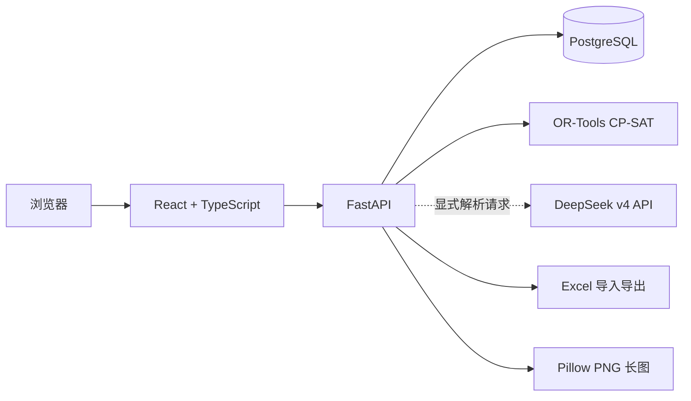

# DNF 团长排表工具

面向 DNF 国服 PC 端团长的人员管理与智能排表网站。项目通过版本化副本配置定义人数、队伍和分队规则，再结合玩家可用波次、角色强度自动生成多波排表。

> 当前状态：阶段 5 公网化工程基线已完成。项目已具备完整业务闭环、多账号权限、单编辑会话、Caddy 自动 HTTPS、生产环境强校验、备份恢复演练，以及 Playwright 浏览器闭环和 1/12/30/50 波性能回归；当前工作以现有 12 人团本流程的稳定性、实际使用反馈、易用性优化和正式上线准备为主。DeepSeek 自然语言规则闭环已实现，默认关闭，配置服务端密钥后启用。

## 当前工作重点与长期 TODO

当前不再按新的产品阶段连续扩张功能，围绕现有 12 人团本集中推进两条主线：

- **紧凑型 UI/UX**：采用 Apple 风格的系统字体、中性背景、蓝色交互强调、轻量层次和紧凑控件，让同一屏幕展示更多排表信息，同时保留清晰的状态和操作反馈。
- **智能排表升级**：严格区分完整度、前置填充、3C1奶、跨波平衡、队伍强度和玩家偏好的优先级，并在生成结果中展示可解释的质量指标。
- **自然语言排表规则（首批已实现）**：使用 DeepSeek v4 解析“本次排表要求”，经结构化预览和团长确认后再由确定性编译器交给 OR-Tools；支持玩家波次限制/偏好、玩家波次互斥、角色指定波次/队伍和连续出场偏好，并在确认前检查玩家可用波次、最多出场次数和角色允许队伍，相关上下文变化后自动要求重新解析。长期规则仍归属于版本化副本配置。

稳定性修复、真实团长数据验证和生产上线准备继续作为两条主线的基础工作；只有在真实反馈或性能数据支持时才扩展其他功能。

军团本人工分组和互带规则仅保留为长期 TODO，目前不作为重点工作，也没有排期。其他长期 TODO 包括多人实时协作、玩家自助报名、动态评分公式、实战数据校正，以及评估让 DeepSeek 生成仅供 OR-Tools 参考的初始提示解。

## 核心能力

- **副本管理**：Owner/Editor 可维护副本基础信息，为新副本创建首个草稿，并通过结构化编辑器配置默认波数、任意数量队伍、每队人数、合法组成、强度顺序、跨波平衡和空位策略；支持版本校验、发布、复制、历史查看和退役，已发布版本保持不可变。
- **人员管理**：默认采用紧凑浏览界面，以五列 Excel 全量同步为主要维护方式，少量调整使用页面表单；不录入角色名和备注，同一玩家职业唯一。每次成功上传都会使旧预览失效，确认后以文件为唯一真源：同键更新、新键新增、文件外记录永久删除，并严格按“序号”重排。角色只保留启用状态；启用玩家的启用角色会自动进入新排表候选并默认选中。
- **奶量换算**：人员档案保存站街奶量；Owner 可在独立页面维护职业倍率并保存不可变版本。页面实时展示“站街奶量/实际奶量”，排表创建时固定换算版本，自动排表、强度统计、发布和导出统一使用实际奶量。
- **智能排表**：当前内置 12 人团本为 v5，强制按“先奶后 C”分阶段生成；奶位依据本次候选池实际奶数量动态确定，C 优先保证红队和前面波次，再按每张排表单独设置的黄绿平均伤害浮动目标进行均衡。生成记录保留各阶段结果和偏离说明。
- **本次排表要求**：Owner/Editor 可让 DeepSeek 把自然语言解释成白名单硬规则和软目标，预览无歧义后确认；最终排表始终由 OR-Tools 生成，生成记录和发布快照保留实际规则及满足情况。
- **人工微调**：支持拖拽、交换、拖回未分配池、锁定、撤销恢复和局部重新生成；未分配角色可按类型、数值或玩家顺序快速整理，波次导航直接显示空白、部分和完整状态。
- **排表生命周期**：发布不可变排表快照，支持复制旧排表、归档和恢复归档；只有从未发布的草稿可由具备专门权限的账号输入名称后二次确认永久删除。
- **分享导出**：支持可过期、可撤销的只读链接，以及 PNG 长图、Excel 和纯文本；草稿导出强制显示水印。
- **账号与 RBAC**：用户管理、角色权限和操作日志使用独立页面；内置 Owner/Editor/Viewer 可兼容原有账号，也可新增自定义角色并按副本、人员、导入、排表、发布、导出、分享和系统管理能力授权。权限变更会撤销相关旧会话，写请求继续使用会话绑定 CSRF 令牌，登录失败按账号和来源限流。
- **单编辑会话**：进入排表时申请独立租约并自动续期；其他会话只读查看，租约过期后可主动刷新、获取或接管编辑权，写操作仍同时校验 revision。

## 默认 12 人团本规则

系统将内置一个 12 人团本副本版本：

| 规则 | 默认值 |
| --- | --- |
| 默认波数 | 13，可在 1～50 波内动态调整 |
| 每波人数 | 12 |
| 队伍 | 红、黄、绿三队 |
| 每队人数 | 4 |
| 合法完整组成 | 3C1奶、2C2奶 |
| 奶位分配 | 先给每队 1 奶；额外奶按红队第 1～N 波、黄队第 1～N 波依次形成双奶 |
| 奶量排序 | 双奶队按最大奶＋最小奶配对；其余单奶依次分配到红、黄、绿队 |
| C 分配 | 最强 C 优先进入红队；红队双奶波首尾配对，红队单奶波按平均伤害均衡 |
| 黄绿平衡 | 黄绿完整队伍按平均伤害整体均衡；浮动默认 20%，每张排表可在 0～100% 调整 |
| C 不足 | 红队保持完整，空位仅留在黄/绿队，并优先保证前面波次完整 |

同一角色在一张排表中最多使用一次；同一玩家在同一波最多使用一个角色，但可以在不同波使用不同角色。玩家可用波次、最多参加波数、锁定角色/位置/波次和已确认硬规则始终优先；与副本组成冲突时停止生成并报告不可行。

## 可扩展副本模型

人数和队伍规则不会写死在页面或求解器中。每个副本通过不可变版本定义：

- 队伍数量、名称、颜色、顺序和人数。
- 每支队伍允许的角色组成及优先级。
- 队伍强度顺序、跨波平衡和待补策略。
- 默认波数、允许波数范围和评分公式版本。

排表绑定具体副本版本，因此发布新副本规则不会改变旧排表或历史导出。该模型可以表达单队 4 人等结构；军团本人工互带工作流仅作为长期 TODO 保留，不属于当前重点或已排期版本。

## 技术架构


```mermaid
flowchart LR
    Browser["浏览器"] --> Web["React + TypeScript"]
    Web --> API["FastAPI"]
    API --> DB[("PostgreSQL")]
    API --> Solver["OR-Tools CP-SAT"]
    API -. 显式解析请求 .-> DeepSeek["DeepSeek v4 API"]
    API --> Excel["Excel 导入导出"]
    API --> Export["Pillow PNG 长图"]
```

| 层级 | 技术 |
| --- | --- |
| 前端 | React、TypeScript、Vite、Ant Design、dnd-kit |
| 后端 | FastAPI、Pydantic、SQLAlchemy、Alembic |
| 智能排表 | OR-Tools CP-SAT |
| 数据库 | PostgreSQL |
| Excel | openpyxl |
| 长图 | Pillow |
| 部署 | Docker Compose |
| 测试 | pytest、Vitest、Playwright、隔离 Docker/PostgreSQL 冒烟与恢复测试 |

MVP 采用模块化单体架构，不引入 Redis、消息队列或微服务。开发阶段在本机通过 Docker Compose 运行，生产环境通过 Caddy 和 Compose 叠加配置部署到公网服务器。

## 项目文档

- [需求设计文档](docs/design.md)：产品范围、业务规则、页面流程和验收标准。
- [技术设计文档](docs/technical-design.md)：系统架构、PostgreSQL、API、求解器、测试和部署方案。
- [生产部署与数据恢复](docs/deployment.md)：HTTPS、生产配置、备份、恢复、升级和日常运维。
- [阶段 5 性能基线](docs/performance-baseline.md)：1/12/30/50 波求解结果、浏览器和全栈验收范围。
- [12 人团本质量基线](docs/raid-quality-baseline.md)：典型人员短缺、锁定、玩家冲突、匿名多角色和分段可用画像的量化门槛。

当前文档版本均为 v0.2。

## 快速开始

### 环境要求

- Node.js 24、pnpm 11。
- Python 3.12、uv。
- Docker Desktop（包含 Docker Compose）。

首次启动：

```bash
make bootstrap
make up
```

`make bootstrap` 会在 `.env` 不存在时从 `.env.example` 创建本地配置，并按锁文件安装依赖。`make up` 会构建并后台启动 PostgreSQL、API 和 Web；API 容器会自动执行 Alembic 迁移和幂等种子。

启动后可访问：

- Web：<http://localhost:5173>
- API 文档：<http://localhost:8000/docs>
- 存活探针：<http://localhost:8000/api/v1/health/live>
- 就绪探针（检查 PostgreSQL）：<http://localhost:8000/api/v1/health/ready>

本地示例账号由 `.env` 中的 `BOOTSTRAP_OWNER_USERNAME` 和
`BOOTSTRAP_OWNER_PASSWORD` 幂等初始化。示例值为 `admin / change-me-now`，首次用于实际数据前请修改密码；公网环境不得使用示例凭据。
本地 Compose 默认会在登录页展示并预填这组账号；设置
`VITE_SHOW_DEV_LOGIN=false` 后重新构建 Web 即可关闭，公网环境必须关闭。

Owner 登录后可分别使用“用户管理”“角色与权限”和“操作日志”：创建或停用账号、重置密码、
撤销在线会话、建立自定义角色、配置权限矩阵，并分页检索登录及写操作。系统所有者角色保持
启用并固定拥有全部权限，避免误操作导致系统失去管理员。
`LOGIN_RATE_LIMIT_ATTEMPTS`、`LOGIN_RATE_LIMIT_SOURCE_ATTEMPTS`、
`LOGIN_RATE_LIMIT_WINDOW_SECONDS` 和 `LOGIN_RATE_LIMIT_LOCK_SECONDS` 分别控制账号来源
组合、单一来源的登录失败阈值、统计窗口及封禁时间；过期限流记录会自动清理。前端会自动把可读的
`dnf_csrf` Cookie 作为 `X-CSRF-Token` 请求头发送；会话 Cookie 始终保持 HttpOnly。
`EDIT_LOCK_LEASE_SECONDS` 和 `EDIT_LOCK_HEARTBEAT_SECONDS` 控制排表编辑租约；默认
90 秒租期、30 秒心跳。租约令牌仅在当前浏览器标签页的 `sessionStorage` 中保存，
服务端只保存哈希。

人员 Excel 只接受固定五列表头：`序号 | 玩家 | 职业 | 类型 | 模拟伤害亿/站街奶量万`。
它是全量名单而不是增量补丁：上传成功后仅保留最新预览，确认时以“玩家 + 职业”为业务键更新或新增，
并永久删除文件外记录；排表参与者使用独立快照，因此删除人员不会改写历史发布结果。空数据文件会被拒绝，
序号必须为同一玩家内不重复的正整数；玩家按首次出现顺序、角色按表格行顺序导入。行级错误直接在人员页面展示。C 伤害必须为整数，
站街奶量可保留两位小数；修改玩家昵称会按“删除旧玩家 + 新增玩家”处理。

奶量换算默认倍率为奶爸 `0.997`、奶枪 `0.995`、奶妈 `1.000`、奶萝 `1.040`、缪斯 `1.002`。
实际奶量按“站街奶量 × 职业倍率”四舍五入保留两位小数，不回写角色表；每张排表固定创建时的
换算版本，后续调整倍率不会改变既有排表和历史导出。

首次升级到本模型的 Alembic 迁移会一次性清理旧排表、发布版本、分享链接、导入批次和操作日志，
并退役旧的内置 12 人团本发布版本；用户、RBAC、副本定义和当前人员档案会保留。生产升级前必须先备份数据库。

自然语言规则默认关闭。需要启用时，在 `.env` 配置
`NATURAL_LANGUAGE_RULES_ENABLED=true` 和 `DEEPSEEK_API_KEY`，并按需调整
`DEEPSEEK_MODEL`、超时、2,000 字输入上限及默认每用户每分钟 10 次的解析限流；重新构建并启动 API 后生效。API Key 仅传入后端容器，不得使用 `VITE_` 前缀或写入前端。
配置完成后可运行 `make test-deepseek-live`，用不含真实玩家数据的合成规则验证公网模型连接、
响应 Schema 和本地引用解析。该命令会产生一次真实 API 调用且不属于默认 `make check`，
输出不会包含密钥、提示词或完整模型响应。

常用命令：

```bash
make test          # 后端 pytest + 前端 Vitest
make check         # 静态检查、前后端、全栈恢复、性能及浏览器完整验收
make test-stack    # 验证迁移、种子、编辑、发布、导出、鉴权和反向代理
make test-e2e      # 验证人员维护、编辑租约和自然语言规则到 OR-Tools 的浏览器闭环
make test-performance # 运行显式 1/12/30/50 波性能基线
make test-quality  # 运行 12 人团本质量场景并输出 JSON 指标
make test-deepseek-live # 显式调用真实 DeepSeek，验证连接和规则解析（可能产生费用）
make solver-poc    # 运行内置 12 人团本和自定义单队 4 人 CP-SAT PoC
make migrate       # 本机对 DATABASE_URL 执行数据库迁移
make seed          # 幂等写入内置 12 人团本及评分公式
make init-owner    # 交互式创建首个 Owner（未使用环境变量时提示输入）
make logs          # 跟踪三个容器日志
make down          # 停止容器，保留 PostgreSQL 数据卷
make prod-config   # 校验 .env.production 和生产 Compose 叠加配置
make release-check # 完整代码验收，并校验本机 .env.production 的生产叠加配置
make prod-up       # 通过 Caddy HTTPS 启动生产容器
make prod-smoke PUBLIC_BASE_URL=https://你的域名 # 验证线上就绪、HTTPS 跳转和安全响应头
make backup        # 生成 PostgreSQL 自定义格式备份
make restore BACKUP_FILE=/path/to/backup.dump  # 显式恢复生产数据库
```

本地 `.env` 中的 `DATABASE_URL` 供宿主机命令使用，连接 `localhost`；`CONTAINER_DATABASE_URL` 供 API 容器使用，连接 Compose 服务名 `db`。两者的用户名、密码和数据库名必须与 PostgreSQL 配置保持一致；用于公网环境前必须替换示例密码。数据库端口只绑定到 `127.0.0.1`。

不使用 Docker 时，可以分别启动开发服务：

```bash
pnpm dev
cd backend && uv run uvicorn app.main:app --reload
```

## 开发进度

- [x] 需求梳理
- [x] 技术设计
- [x] 副本扩展模型
- [x] 初始化 React、FastAPI 和 Docker Compose 工程
- [x] 建立首批副本 PostgreSQL Schema、迁移和种子
- [x] 完成 OR-Tools 阶段 0 算法 PoC
- [x] 建立 Owner 登录和服务端会话
- [x] 开发副本版本、人员管理及 Excel 导入基础闭环
- [x] 建立排表、参团快照、玩家偏好、波次、队伍和位置 Schema
- [x] 完成排表创建/复制、波数调整、参团选择和角色快照同步
- [x] 完成玩家波次偏好、结构化预检查和只读空排表编辑器
- [x] 开发 OR-Tools 自动排表、锁定保留、求解诊断和生成记录
- [x] 开发拖拽编辑器、发布版本、只读分享和多格式导出
- [x] 完善发布预检、历史版本预览/复制、分享管理和草稿水印导出
- [x] 完成多账号、可配置 RBAC、用户/角色/操作日志独立管理、CSRF、登录限流和审计基线
- [x] 完成单编辑会话锁、心跳、超时接管和 Viewer 前端只读降级
- [x] 完成 HTTPS 入口、生产安全配置和部署文档
- [x] 完成隔离 PostgreSQL 备份恢复演练和生产恢复脚本
- [x] 完成 Playwright 浏览器端到端测试和 1/12/30/50 波性能验收
- [x] 建立 14 个 12 人团本质量画像，覆盖短缺、锁定、玩家冲突、复杂规则交集和真实分布匿名画像
- [x] 实现 DeepSeek v4 自然语言规则解析、确认、编译、按用户限流和生成解释闭环
- [x] 优化排表管理操作层级、波次导航、未分配池、玩家偏好、编辑权恢复和持久化生成记录展示

## 已完成实施顺序

```text
工程初始化与算法 PoC
→ 副本管理
→ 人员管理与 Excel 导入
→ 排表基础与预检查
→ OR-Tools 自动排表
→ 拖拽微调与角色/位置/波次锁定
→ 发布版本与导出
→ 多账号、单编辑会话锁与公网部署
→ 浏览器闭环、备份恢复和性能验收
→ DeepSeek 规则解释、团长确认与 OR-Tools 确定性执行
```

## 当前目录结构

```text
dnf-leader-tool/
├── frontend/              # React 应用
├── backend/               # FastAPI、领域逻辑、模型、迁移和求解器
├── docs/                  # 需求和技术文档
├── infra/                 # 容器及反向代理配置
├── compose.yaml
├── .env.example
├── Makefile
└── README.md
```

## 数据与部署约定

- PostgreSQL 数据使用持久化卷，生产环境不暴露数据库公网端口。
- `.env`、密钥、数据库文件、上传文件、导出文件和本地备份不会提交到 Git。
- `pnpm-lock.yaml`、`uv.lock`、Alembic 迁移和 `.env.example` 应提交到仓库。
- 已发布副本版本和排表版本保持不可变。
- 公网部署前必须完成数据库备份与恢复演练。
