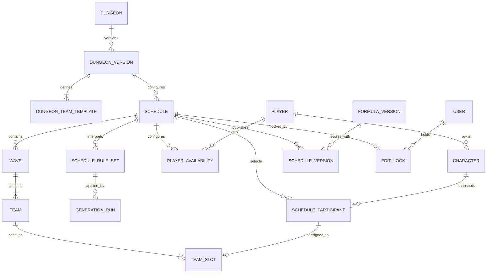

# DNF 团长排表工具设计文档

> 文档版本：v0.3
> 状态：需求确认稿  
> 当前范围：国服 PC 端 DNF、副本管理、12 人团本排表和自然语言排表规则
> 长期 TODO（非当前重点）：军团本、实时多人协作

## 1. 文档目的

本项目面向 DNF 国服 PC 端团长，解决玩家及多角色维护、连续多波团本排期、自动分队、人工微调和排表分享问题。

系统以“排表”为一次独立的角色次数周期：同一角色在一张排表中最多出场一次；创建或复制新排表后，全部角色重新获得可用次数。

## 2. 产品目标

### 2.1 核心目标

1. 统一维护玩家及其多个角色。
2. 通过副本管理配置每波人数、队伍数量、每队容量、合法组成和特殊角色规则。
3. 根据玩家可用波次、角色类型、伤害、奶增益量和秘宝 C 标记自动生成多波排表。
4. 在保证硬约束的基础上，使不同波次总体实力尽量接近。
5. 默认 12 人团本每波形成红、黄、绿三队，并满足红队不弱于黄队、黄队不弱于绿队。
6. 团长能够通过拖拽、交换、锁定和重新计算快速微调。
7. 保留排表版本和历史，并支持多种分享及导出方式。
8. 允许团长用自然语言补充本次开团要求，并在确认结构化解释后参与自动排表。

### 2.2 非目标

以下内容不进入首期 MVP：

- 军团本分组及“互带混子”规则（长期 TODO，当前不排期）。
- 普通参团玩家自助报名。
- 多人实时共同编辑同一张排表。
- 从游戏客户端、截图或第三方接口自动读取角色数据。
- 基于实战记录自动训练或修正评分模型。
- 让大模型直接生成最终排表、执行任意表达式或自动修改已发布副本规则。

## 3. 术语

| 术语 | 含义 |
| --- | --- |
| 玩家 | 实际参团人员，一名玩家可拥有多个角色 |
| 角色 | 玩家名下的某一个游戏角色 |
| C | 输出角色，主要强度指标为手动录入的伤害 |
| 奶 | 辅助角色，主要强度指标为手动录入的增益量 |
| 秘宝 C | 团长在角色档案中标记的大号 C |
| 副本 | 定义排表人数、队伍和分队规则的可复用配置 |
| 副本版本 | 某次已发布的不可变副本规则，供排表引用 |
| 排表 | 一次独立的完整排队，包含若干波团本 |
| 波 | 一次副本运行；内置 12 人团本由红、黄、绿三队组成 |
| 队伍 | 人数和合法组成由副本版本定义；内置团本每队 4 人 |
| 待补 | 参团角色不足或约束冲突导致的空缺位置 |
| 参团属性 | 角色档案中的默认值，用于新建排表时自动带入角色 |
| 排表规则集 | 某张排表中经解析和团长确认、只对本次排表生效的结构化自然语言规则 |

## 4. 用户与权限

### 4.1 MVP 用户

- Owner（团长）：管理账号，维护人员，创建排表，自动生成、微调、发布和导出，并查看审计记录。
- Editor（协作者）：共享同一套业务数据，可执行日常编辑和发布，但不能管理账号。
- Viewer（查看者）：查看人员、副本、排表、历史版本和导出，不允许修改业务数据。

普通参团玩家首期不需要登录。

### 4.2 编辑锁

MVP 采用单编辑锁：

1. 用户进入排表编辑模式时申请编辑锁。
2. 获得锁的用户可修改，其他用户只能查看。
3. 页面定期发送心跳续期。
4. 正常退出、主动释放或锁超时后，其他用户可接管编辑。
5. 保存时同时检查排表版本号，避免过期页面覆盖新数据。

后续版本可将其升级为 WebSocket 实时协作。

## 5. MVP 信息架构

```text
副本管理
├── 副本列表
├── 新建/编辑副本
├── 队伍与人数配置
├── 合法组成和特殊角色规则
└── 副本版本

人员管理
├── 玩家与角色列表
├── 手动新增/编辑
├── Excel 导入
└── Excel 模板下载

团本排表
├── 排表列表
├── 新建排表
├── 复制排表
├── 参团角色与玩家波次设置
├── 预检查
├── 自动排表
├── 总览/单波编辑
└── 发布与导出

历史记录
├── 已发布版本
└── 已归档排表

系统设置
└── 评分公式版本（首期只读展示）
```

军团本菜单只作为长期 TODO 的概念预留，当前不排期，也不展示未完成入口。

## 6. 业务规则

### 6.0 副本配置

副本管理是排表的规则来源，避免把“12 人、3 队、每队 4 人”写死在程序中。

每个副本可以配置：

- 副本名称、唯一编码、启用状态和备注。
- 默认波数以及允许的波数范围。
- 每波包含的队伍数量。
- 每支队伍的名称、标识、颜色、显示顺序和人数。
- 每支队伍允许的角色组成，例如 `3C1奶`、`2C2奶`。
- 队伍强度顺序，例如红队 ≥ 黄队 ≥ 绿队。
- 是否要求特殊角色、特殊角色标签、数量和目标队伍。
- 是否启用跨波强度平衡，以及空位优先集中还是均匀分散。
- 使用的评分公式版本。

副本总人数由所有队伍人数之和计算，不单独维护一份可能不一致的总人数。

首期内置“12 人团本”副本：

```text
默认波数：12
每波人数：12
队伍：红队、黄队、绿队
每队人数：4
合法组成：优先 3C1奶，允许 2C2奶
特殊角色：每波一个秘宝 C，目标为红队
强度顺序：红队 ≥ 黄队 ≥ 绿队
```

副本规则采用版本管理：已被排表使用的版本不可直接修改；调整人数或规则时创建新版本。已有草稿、已发布排表和历史导出继续使用原版本，不被新规则改变。

副本管理页面提供完整操作闭环：Owner/Editor 可以修改副本名称、说明和启用状态；新建副本后直接进入首个草稿配置；无版本副本也可随时创建首个草稿。草稿使用结构化表单维护波数、队伍、合法组成、秘宝 C、强度顺序、跨波平衡和空位策略，并在保存前显示人数覆盖问题。版本历史支持查看、复制、校验、发布和退役；已发布及已退役版本只读，继续调整时必须复制为新草稿。Viewer 只能查看副本和版本规则。

长期稳定且需要复用的规则仍归属于副本版本，例如队伍容量、合法组成、秘宝 C 目标队伍和强度顺序。副本编辑器后续可以提供“自然语言辅助配置”，但其作用仅限于填充结构化表单；发布版本的执行依据始终是经过确认和校验的结构化规则，不保存一段自由文本作为求解器规则真源。

评分公式首期在副本版本编辑器中只读展示并随复制保留，避免误改已存在的公式版本；后续动态公式配置仍属于长期 TODO。

副本管理提供通用人数和队伍结构，但不代表实现军团本的人工互带工作流。军团本只保留为长期 TODO；未来若重新确认优先级，可以复用同一副本版本模型，再增加专用分组页面和业务规则。

### 6.1 排表和波次

1. 新建排表先选择副本版本；内置 12 人团本默认 12 波。
2. 团长可以动态增加或减少波数。
3. 波次中的队伍和位置由副本版本生成；内置 12 人团本包含红、黄、绿三个 4 人队伍。
4. 一张排表的总容量为：

   ```text
   每波人数 = Σ(副本版本中的各队人数)
   总容量 = 波数 × 每波人数
   ```

5. 默认参团角色数超过总容量时给出错误提示，要求减少参团角色或增加波数。
6. 参团角色不足时仍允许生成草稿，空位显示“待补”。
7. 空位优先集中在最后几波，使前面的波次尽量完整。
8. 排表不记录业务上的“开团日期”和“所属周期”；通过排表名称、系统创建时间和归档状态管理历史。

### 6.2 角色次数和玩家冲突

1. 同一角色在一张排表中最多出现一次。
2. 同一玩家在同一波最多使用一个角色。
3. 同一玩家可以在不同波使用不同角色。
4. 新建或复制排表会开启新的独立次数周期。
5. 角色是否已在旧排表中出场，不影响新排表。

### 6.3 队伍组成

1. 每队人数和合法组成来自当前排表引用的副本版本。
2. 内置 12 人团本每队固定 4 个位置。
3. 默认并优先生成 `3C1奶`。
4. 当 C 不足且奶有富余时，允许生成 `2C2奶`。
5. 内置 12 人团本中的 `4C`、`1C3奶` 等其他完整队伍配置视为冲突。
6. 含“待补”位置的不完整队伍允许存在于草稿中，但需要显示缺口类型。

对于内置 12 人团本，理想状态下每波需要 9 个 C 和 3 个奶。预检查需要同时展示：

- 理想 C 缺口：`波数 × 9 - 当前 C 数量`。
- 基础奶缺口：`波数 × 3 - 当前奶数量`。
- 使用 2C2奶 后是否可能补足完整队伍。
- 无法使用的多余角色及具体原因。

### 6.4 特殊角色与秘宝 C

特殊角色规则来自副本版本。内置 12 人团本使用“秘宝 C”规则：

1. “是否秘宝 C”是角色档案中的布尔属性，由团长维护。
2. 自动排表时，每个完整波次选择一个秘宝 C 作为红队核心。
3. 红队核心秘宝 C 固定进入红队。
4. 参团秘宝 C 数量可以多于波数。
5. 未被选为某波核心的秘宝 C 仍可作为普通 C 安排到任意队伍。
6. 团长可以手动替换每波的核心秘宝 C。
7. 秘宝 C 不足时仍可生成草稿，但缺少核心的波次必须显示警告。

### 6.5 战斗力数据

#### C

- 由团长手动录入伤害。
- 单位为“亿”。
- 数据库存储为定点小数，建议首期保留两位小数。

#### 奶

- 由团长手动录入固定增益评分。
- 输入示例：`4.1`、`5.2`、`3.0`。
- 首期保留一位小数。

#### 首期评分公式

```text
队伍 C 强度 = 队内所有 C 的伤害之和
队伍奶强度 = 队内所有奶的增益评分之和
```

正常的 3C1奶 队伍只有一个奶；发生 2C2奶 时，首期暂按两个奶的评分之和展示。该规则需要作为公式版本的一部分，后续允许调整。

### 6.6 队伍强弱关系

队伍强度顺序来自副本版本。内置 12 人团本每波内部需要尽量满足：

```text
红队 C 强度 ≥ 黄队 C 强度 ≥ 绿队 C 强度
红队奶强度 ≥ 黄队奶强度 ≥ 绿队奶强度
```

红队已有一个秘宝 C，因此算法应尽量给它搭配两个相对较弱的 C，把较强的普通 C 留给黄队和绿队。这里的“较弱”不是固定取全池最低，而是在满足队伍顺序和跨波平衡后的优化结果。

若受可用波次、同玩家冲突或数据相同等因素影响，无法满足顺序，系统仍生成草稿并给出可定位的警告。

### 6.7 跨波平衡

内置 12 人团本的不同波次之间没有优先级差异，除空位需要集中到后几波外，完整波次的实力应尽量接近。其他副本可在版本中配置是否启用相同策略。

由于 C 和奶采用独立评分，跨波平衡分别优化：

- 各完整波次的 C 总伤害差异。
- 各完整波次的奶总评分差异。
- 各波秘宝 C 强度与普通角色强度的搭配。

## 7. 人员管理

### 7.1 数据结构

玩家是角色的归属主体。一名玩家可以拥有多个角色，但同一职业最多一个。

#### 玩家字段

| 字段 | 必填 | 说明 |
| --- | --- | --- |
| 玩家称呼 | 是 | Excel 分组和页面展示使用 |
| 启用状态 | 是 | 停用后默认不进入新排表 |
| 显示顺序 | 系统 | 支持在人员页面拖拽调整并持久化 |
| 创建/修改时间 | 系统 | 审计字段 |

#### 角色字段

| 字段 | 必填 | 说明 |
| --- | --- | --- |
| 所属玩家 | 是 | 关联玩家 |
| 职业 | 是 | 展示及后续规则扩展 |
| 类型 | 是 | C 或奶 |
| 伤害/增益量 | 是 | 根据类型使用不同单位和精度 |
| 是否秘宝 C | 是 | 仅 C 可设置 |
| 是否固定红队奶 | 是 | 仅奶可设置；自动排表时进入强度排名最高的队伍 |
| 是否群猎 | 是 | 仅 C 可设置；当前作为结构化角色标记保留 |
| 是否默认参加团本 | 是 | 创建排表时使用 |
| 备注 | 历史兼容 | 保留旧数据，不在人员页面录入或展示 |
| 启用状态 | 是 | 停用后默认不进入新排表 |
| 显示顺序 | 系统 | 在所属玩家内拖拽调整并持久化 |

不记录跨区和服务器字段。

### 7.2 手动维护

- 支持新增玩家并连续添加多个角色。
- 支持在玩家分组下新增、编辑、停用角色。
- 支持拖拽调整玩家顺序及每名玩家内部的角色顺序，刷新或重新登录后保持；搜索结果中不开放局部排序。
- 删除有历史排表引用的角色时采用停用，不进行物理删除。
- 人员页面不录入或展示角色名和备注，以玩家称呼和职业识别角色；新增时拒绝同玩家重复职业。
- 支持按玩家、职业、类型、秘宝 C、默认参团和状态筛选。
- 支持批量修改“默认参团”和启用状态。

### 7.3 Excel 导入

Excel 一行代表一个角色，模板字段为：

```text
序号 | 玩家昵称 | 职业 | 类型 | 模拟伤害亿/增益量万 | 是否秘宝C | 固定红队奶 | 是否群猎 | 是否参与团本
```

导入流程：

1. 上传 Excel。
2. 在所有工作表中查找包含必要列的角色数据页，其他历史统计、攻略或分组页不参与导入。
3. 校验列名、类型、必填字段和数值格式；布尔列空白按“否”处理。
4. 按“玩家昵称”自动创建或匹配玩家。
5. 按“玩家昵称 + 职业”匹配已有角色；文件内或数据库中同玩家重复职业均拒绝写入。
6. 展示新增、更新、忽略和错误的变更预览。
7. 团长确认后在单个数据库事务中写入，并按 Excel 数据行首次出现的顺序排列玩家及其角色；未出现在表格中的既有玩家和角色保持原相对顺序并排在导入项之后。
8. 生成可下载的错误明细。

再次导入同一玩家的同职业角色时默认更新已有数据，但必须经过变更预览确认。

## 8. 排表工作流

### 8.1 创建

团长可以：

- 选择一个已启用的副本版本新建空白排表，波数默认使用副本配置。
- 复制一张旧排表创建新排表。

新建排表时，将角色档案中的“默认参加团本”复制为当前排表的参团角色快照。之后在排表中增减参团角色，不反向修改角色档案。

### 8.2 复制

复制旧排表时：

- 复制排表名称并生成可编辑的新名称。
- 默认复制原副本版本、波数、参团角色选择、玩家可用波次、偏好和队伍结构。
- 所有角色在新排表中恢复可用次数。
- 清除发布、归档、编辑锁和冲突处理状态。
- 自然语言原文可以带入新排表作为待解析内容，但不复制原排表已确认规则；必须基于新参团快照重新解析和确认。
- 默认使用人员池中的最新角色数值和属性。
- 已停用或已删除引用的角色进入“待处理”列表。

复制时可以选择升级到该副本的最新版本；如果队伍数量、人数或规则发生变化，系统必须先展示迁移预览，不能静默改变原队伍结构。

### 8.3 玩家可用波次

可用波次属于当前排表，不属于永久玩家档案。每名参团玩家支持：

- 默认全波次可用。
- 勾选任意具体波次。
- 快速选择连续范围。
- 设置最多参加波数。
- 设置“优先靠前”的软偏好。
- 设置“尽量连续上号”的软偏好。

波数发生变化时自动清理越界选择，并重新进行可行性检查。

### 8.4 预检查

自动排表前必须输出结构化检查报告：

| 检查项 | 级别 | 处理方式 |
| --- | --- | --- |
| 参团角色超过总容量 | 错误 | 提示减少角色或增加波数 |
| 角色重复 | 错误 | 同一角色不能出现两次 |
| 玩家可用波次不足 | 错误/警告 | 定位玩家及无法安排的角色 |
| 每波不同玩家数量不足 | 警告 | 提示受“同玩家同波唯一”限制，任何波次都无法排满 |
| C 数量不足理想值 | 警告 | 尝试 2C2奶 或产生待补 |
| 奶数量不足基础值 | 警告 | 对应奶位置待补 |
| 秘宝 C 少于波数 | 警告 | 对应波次缺少核心 |
| 参团角色少于总容量 | 提示 | 空位集中至后几波 |
| 无法满足红黄绿顺序 | 警告 | 仍允许生成草稿 |

检查结果必须说明“缺什么、缺多少、影响哪些玩家或波次”，不能只显示“无法排表”。

### 8.5 本次排表的自然语言要求

自然语言规则属于当前排表，不属于永久人员档案，也不直接修改当前排表引用的副本版本。排表生成区提供“本次排表要求”输入框，适合描述只在本次开团生效的要求，例如：

- “韩亚尽量安排在前 6 波。”
- “剑来和点评不能在同一波。”
- “奶不足时优先保证红队和黄队。”
- “群猎角色尽量安排在前 4 波。”

首期使用 DeepSeek v4 将自然语言转换为系统支持的结构化硬约束和软目标。模型不直接生成最终排表，也不直接修改数据库；解析结果必须经过以下流程：

1. 显示原始文本、已识别规则、涉及的玩家/角色/队伍/波次、硬软类型和生效优先级。
2. 名称存在歧义、引用不存在、规则不受支持或与当前副本冲突时，禁止确认并给出具体问题。
3. 团长确认后形成当前排表的规则集；修改原文必须重新解析和确认。
4. 自动生成只读取已确认的结构化规则集，并在结果中说明满足、未满足和发生冲突的规则。
5. 每次生成保存实际使用的规则快照、模型标识和解析版本，确保历史结果可以复现和解释。
6. 参团人员、波数或副本结构变化使解析上下文失效时，规则集标记为“待重新解析”，在重新确认前不参与生成；拖拽和锁定变化只触发确定性冲突检查，不重新调用模型。

允许 Viewer 查看原文和解析结果，但只有持有当前排表编辑租约的 Owner/Editor 可以解析、确认、停用或替换规则集。

副本硬规则、系统不变量和当前手动锁定不能被自然语言绕过。首期规则优先级为：

1. 系统不变量：角色在一张排表中最多一次、同一玩家同一波最多一个角色。
2. 当前副本版本的容量、组成和特殊角色硬规则。
3. 当前排表的角色、位置和波次锁定。
4. 已确认的自然语言硬规则；若与锁定冲突则阻止生成，要求解除锁定、修改规则或将规则降级为软目标。
5. 已安排人数、完整波次/队伍、空位靠后、组成和秘宝 C 等核心生成目标。
6. 已确认的自然语言软目标。
7. 副本强度顺序、跨波平衡、特殊角色搭配、玩家偏好和稳定排序。

模型不能自行创建新的约束类型或数值权重。无法映射到当前规则白名单的内容显示为“不支持”，由团长改写或改为人工锁定。

### 8.6 自动生成

系统生成一个推荐方案。团长可锁定部分安排后重新生成，锁定内容保持不变。

生成结果包括：

- 各波红、黄、绿队伍。
- 每波核心秘宝 C。
- 队伍 C 强度和奶强度。
- 各波总强度对比。
- 未分配角色池。
- 待补位置。
- 冲突和弱约束未满足说明。

### 8.7 微调

排表编辑器需要尽量完整支持：

- 拖拽角色到同队、跨队或跨波位置。
- 两个角色快速交换。
- 从未分配角色池拖入队伍。
- 将角色拖回未分配角色池。
- 锁定角色、位置或整波。
- 仅重新生成未锁定部分。
- 撤销和恢复。
- 修改后实时重新计算 C 强度、奶强度和冲突。
- 手动更换某波核心秘宝 C。

系统禁止复制同一角色到多个位置。其他业务冲突允许暂时存在于草稿中，但必须明显标识。

## 9. 排表页面设计

### 9.1 总览视图

- 纵向展示全部波次。
- 每波横向展示红、黄、绿三个队伍。
- 适合整体检查、跨波拖拽和导出长图。
- 显示波次强度、完整度和冲突数量。

### 9.2 单波视图

- 聚焦一波的 12 个位置。
- 展示队伍详细分数、角色信息和冲突原因。
- 适合精细交换和更换核心秘宝 C。

### 9.3 角色卡片

默认显示：

- 玩家称呼。
- 职业。
- C 伤害或奶增益量。
- 秘宝 C 标识。
- 锁定状态。
- 冲突状态。

### 9.4 未分配角色池

- 位于编辑器侧边栏或抽屉。
- 支持按玩家、类型、分数和冲突原因筛选。
- 明确区分“容量不足”“玩家波次冲突”“角色类型不匹配”等未分配原因。

## 10. 排表状态、版本和历史

### 10.1 状态

```text
草稿 → 已发布 → 已归档
```

- 草稿：允许自动生成和任意微调。
- 已发布：形成不可变发布版本；继续修改时基于该版本创建新草稿版本。
- 已归档：只读保存，不参与默认列表。

### 10.2 版本

每次发布保存完整排表快照，包括：

- 副本版本、队伍结构和规则快照。
- 角色展示信息和评分快照。
- 波次、队伍和位置。
- 玩家可用波次配置。
- 核心秘宝 C。
- 评分公式版本。
- 警告和待补位置。

人员池后续发生变化时，不自动改变已发布或已归档版本。

草稿可提供“同步最新角色数据”操作；同步前展示将发生变化的角色和分数。

## 11. 导出与分享

MVP 尽量支持以下全部方式：

1. 网站只读查看页。
2. 一键导出完整长图，适合发送到聊天群。
3. Excel 导出。
4. 复制纯文本排表。

所有导出内容必须基于指定的已发布版本，保证分享后不会因继续编辑而变化。草稿导出需要带“草稿”水印。

## 12. 智能排表算法设计

### 12.1 技术选择

使用 Google OR-Tools CP-SAT 建模。它适合处理角色唯一性、玩家同波冲突、可用波次、队伍组成、位置锁定等组合约束。

C 伤害和奶评分在进入求解器前转换为整数：

```text
C伤害整数 = 亿单位伤害 × 100
奶评分整数 = 奶评分 × 100
```

内置 12 人团本 v2 使用两位小数奶量公式；旧副本版本继续保留原公式快照。标记为固定红队奶的参团角色通过通用的允许队伍约束进入 `strength_rank` 最小的队伍，求解器不写死 `RED`。

### 12.2 决策变量

核心决策变量表示：

```text
角色 r 是否被分配到 波次 w / 队伍 t / 位置 s
```

辅助变量表示：

- 某角色是否满足当前副本的特殊角色规则。
- 某队采用副本版本中的哪一种合法组成。
- 各队 C 强度和奶强度。
- 各波 C 总强度和奶总强度。
- 角色是否未分配。
- 位置是否待补。

### 12.3 硬约束

1. 每个位置最多一个角色。
2. 每个角色最多分配一次。
3. 同一玩家同一波最多一个角色。
4. 角色只能进入玩家允许的波次。
5. 玩家出场波数不超过其设置上限。
6. 锁定的角色和位置不可被重新生成改变。
7. 每队人数和角色类型必须符合副本版本的队伍与组成配置。
8. 特殊角色的标志、数量和目标队伍必须符合副本版本规则。

对于内置 12 人团本，第 7、8 条具体表现为 3C1奶/2C2奶 和“每波一个红队核心秘宝 C”。

### 12.4 软目标优先级

建议采用分阶段或分层权重求解，避免一个超大混合公式难以解释：

1. 最大化被安排的参团角色数量。
2. 按副本空位策略优化波次填充：`SPREAD_EVENLY` 先最小化各波人数差；`FILL_EARLIER_WAVES` 在完整度目标后优先填充较早波次。
3. 最大化完整波次和完整队伍数量，并按副本版本中的组成优先级选择；内置团本优先 3C1奶。
4. 最大化满足副本特殊角色规则的完整波次数；内置团本即红队核心秘宝 C。
5. 最小化副本强度顺序冲突的差值；内置团本即 `红 ≥ 黄 ≥ 绿`。
6. 在保持队伍强度顺序结果的前提下，分别最小化完整波次间 C 总伤害差和奶总评分差。
7. 执行特殊角色规则附带的搭配目标；内置团本在满足顺序后最小化红队核心之外的 C 强度占用。
8. 满足玩家“优先靠前”和“尽量连续”的偏好。
9. 尽量减少未分配角色和人工警告数量。

自然语言规则不会变成一个可以补偿前级目标的超大权重。确认后的硬规则编译为 CP-SAT 约束；软规则由服务端映射到固定的词法序目标阶段，放在完整度、空位、组成和秘宝 C 等核心目标之后，放在队伍强度、跨波平衡和普通玩家偏好之前。解析预览必须明确显示最终位置，模型返回的原始权重不参与求解。

### 12.5 不可行与超时处理

- 求解设置时间上限，达到上限时返回当前最优可行解，而不是无限等待。
- 完全不可行时，放宽软约束并生成部分排表。
- 硬约束导致角色无法安排时，将其放入未分配角色池并说明原因。
- 保存本次求解摘要，便于定位算法结果和后续调参。

## 13. 数据模型



### 13.1 主要表

#### dungeons / dungeon_versions / dungeon_team_templates

- `dungeons` 保存副本名称、唯一编码、启用状态和备注。
- `dungeon_versions` 保存默认波数、允许波数范围、评分公式、合法组成、特殊角色规则和版本状态。
- `dungeon_team_templates` 保存队伍标识、名称、颜色、排序、人数和强度顺序。
- 已发布且被排表引用的副本版本不可修改，只能创建新版本。

#### players

- `id`
- `display_name`
- `is_active`
- `created_at`
- `updated_at`

#### characters

- `id`
- `player_id`
- `name`
- `profession`
- `role_type`：`DAMAGE` / `BUFFER`
- `damage_score`：亿单位定点小数，可空
- `buffer_score`：一位小数，可空
- `is_treasure_damage`
- `default_raid_participant`
- `note`
- `is_active`
- `created_at`
- `updated_at`

#### schedules

- `id`
- `name`
- `dungeon_version_id`
- `wave_count`
- `status`：`DRAFT` / `PUBLISHED` / `ARCHIVED`
- `formula_version_id`
- `note`
- `revision`
- `created_by`
- `updated_by`
- `created_at`
- `updated_at`

#### schedule_rule_sets

- `schedule_id`
- `source_text`
- `status`：`PARSED` / `CONFIRMED` / `STALE` / `SUPERSEDED` / `FAILED`
- `model_provider`、`model_name`
- `prompt_version`、`schema_version`
- `parsed_rules`：模型返回并通过 Schema 校验的结构化规则
- `resolved_references`：玩家、角色、队伍和波次引用快照
- `issues`：歧义、冲突和不支持项
- `confirmed_by`、`confirmed_at`

排表同一时刻最多有一个生效的 `CONFIRMED` 规则集。规则集确认后不原地修改；编辑原文会创建新的解析记录，并在确认时替换旧规则集。每次自动生成另外保存实际生效规则快照，避免后续替换规则集影响历史生成记录。

#### schedule_participants

保存角色引用和当前排表使用的角色快照：

- `schedule_id`
- `character_id`
- `player_id_snapshot`
- `player_name_snapshot`
- `character_name_snapshot`
- `profession_snapshot`
- `role_type_snapshot`
- `damage_score_snapshot`
- `buffer_score_snapshot`
- `is_treasure_damage_snapshot`
- `selected`
- `locked`

#### player_availability

- `schedule_id`
- `player_id`
- `allowed_waves`
- `max_wave_count`
- `prefer_early`
- `prefer_contiguous`

#### waves / teams / team_slots

保存波次顺序、队伍颜色、位置序号、角色分配、锁定状态和核心秘宝 C 标识。

#### schedule_versions

保存每次发布的完整不可变 JSON 快照、版本号、公式版本、发布人和发布时间。

#### edit_locks

保存排表、持有者、锁令牌、到期时间和最近心跳时间。

## 14. API 边界

建议按领域拆分接口：

```text
/api/dungeons
/api/dungeons/{id}/versions
/api/dungeon-versions/{id}/publish
/api/players
/api/characters
/api/imports/characters
/api/schedules
/api/schedules/{id}/participants
/api/schedules/{id}/availability
/api/schedules/{id}/validate
/api/schedules/{id}/generate
/api/schedules/{id}/sync-characters
/api/schedules/{id}/versions
/api/schedules/{id}/exports
/api/schedules/{id}/lock
```

自动生成、复制、发布和导入确认必须使用事务，避免写入一半的数据。

## 15. 技术架构

### 15.1 技术栈

| 层级 | 选择 |
| --- | --- |
| 前端 | React + TypeScript + Vite |
| UI | Ant Design |
| 拖拽 | dnd-kit |
| 后端 | FastAPI |
| 求解器 | OR-Tools CP-SAT |
| 数据库 | PostgreSQL |
| ORM 与迁移 | SQLAlchemy + Alembic |
| Excel | openpyxl |
| 长图 | Pillow |
| 部署 | Docker Compose |
| 测试 | Vitest + pytest + Playwright E2E + 隔离 Docker/PostgreSQL 冒烟与恢复测试 |

### 15.2 部署结构

```text
浏览器
  │
  ├── React 静态站点
  │
  └── FastAPI
       ├── PostgreSQL
       ├── OR-Tools
       ├── Excel 导入导出
       └── Pillow PNG 长图生成
```

本地阶段使用 Docker Compose 启动前端、后端和 PostgreSQL。后续迁移到公网单机时复用相同容器结构，在入口增加 HTTPS 反向代理。

PostgreSQL 只允许容器内部访问，不直接开放到公网。

## 16. 非功能需求

### 16.1 性能目标

- 常规人员列表操作在本地环境下应即时响应。
- 默认 12 波自动排表应在可接受等待时间内返回阶段性最优结果。
- 算法需要时间上限和进度状态，不能导致 HTTP 请求无限挂起。
- 总览页面应对几十波数据使用合理的组件拆分或虚拟化，避免拖拽卡顿。

### 16.2 数据安全

- PostgreSQL 使用持久化卷。
- 提供数据库备份脚本和恢复说明。
- 公网部署后使用强密码、HTTPS、HttpOnly 会话 Cookie 和 CSRF 防护。
- 导入文件限制大小和格式，解析失败不写入数据库。
- 所有发布版本保持不可变。

### 16.3 可维护性

- 业务规则与页面组件分离。
- 排表求解器作为独立领域模块，不直接依赖 HTTP 层。
- 评分公式带版本号；历史排表始终引用原公式版本。
- PostgreSQL Schema 变更全部通过 Alembic 迁移。

## 17. MVP 验收标准

### 副本管理

- 能创建、编辑、停用副本并发布新版本。
- 能配置队伍数量、队伍名称、每队人数和合法组成。
- 能配置默认波数、强度顺序和秘宝 C 等特殊角色规则。
- 修改副本规则不会改变引用旧版本的排表和历史导出。
- 系统内置的 12 人团本配置与当前确认规则一致。

### 人员管理

- 能手工维护一名玩家及多个角色。
- 能按约定模板导入 Excel，并预览新增、更新和错误。
- 能设置 C 伤害、奶评分、秘宝 C 和默认参团属性。

### 排表创建

- 能选择副本版本创建排表；内置 12 人团本默认创建 12 波，并可动态增减。
- 能复制旧排表形成全新角色次数周期。
- 能设置玩家可用波次、最多波数及软偏好。
- 人数或角色类型异常时给出具体检查结果。

### 自动排表

- 同一角色不会重复。
- 同一玩家不会在同一波出现两次。
- 优先生成 3C1奶，必要时允许 2C2奶。
- 每个完整波次尽量拥有一个红队秘宝 C。
- 空位集中在后几波。
- 波次之间尽量平衡。
- 单波尽量满足红队、黄队、绿队强度降序。
- 能输入本次排表的自然语言要求，预览并确认结构化规则；名称歧义、规则冲突和不支持内容有明确提示。
- 相同副本、参团快照、确认规则集和生成参数可以重放，DeepSeek 不参与确认后的重复求解。

### 微调和历史

- 支持拖拽、交换、锁定、重新生成和撤销恢复。
- 冲突能够实时显示并定位。
- 发布后形成不可变版本。
- 能查看、复制和归档历史排表。

### 分享

- 至少能够导出长图和 Excel。
- 纯文本和只读链接按实现进度一并进入 MVP。

## 18. 迭代计划

### 阶段 1：项目骨架、副本管理与人员管理

- Docker Compose、本地开发环境和 PostgreSQL。
- 副本、版本、队伍人数和规则配置。
- 玩家、角色 CRUD。
- Excel 模板、导入预览和确认。

### 阶段 2：排表基础能力

- 排表创建、复制、波数和参团快照。
- 玩家可用波次。
- 预检查和空排表编辑器。

### 阶段 3：智能排表

- OR-Tools 约束模型。
- 3C1奶 / 2C2奶、秘宝 C、玩家冲突。
- 跨波平衡和红黄绿优化。
- 未分配原因与求解摘要。

### 阶段 4：完整编辑与发布

- 拖拽、交换、锁定和撤销恢复。
- 总览及单波视图。
- 发布版本、历史和复制。
- 长图、Excel、文本和只读页。

### 阶段 5：公网化

- 多账号、Owner/Editor/Viewer 权限、CSRF、登录限流和审计基线（已完成）。
- 单编辑会话锁、心跳、超时接管和 Viewer 前端只读降级（已完成）。
- HTTPS、生产安全配置、备份恢复脚本和部署文档（已完成）。
- Playwright 浏览器闭环、1/12/30/50 波性能基线和隔离恢复验收（已完成）。

### 当前工作重点

#### 12 人团本 UI/UX 优化

- 使用 Apple 风格的系统字体、中性灰背景、蓝色交互强调、轻量阴影和半透明层次，不照搬 Apple 品牌资产。
- 全局采用紧凑尺寸：缩短顶栏和侧栏、减少卡片与表格留白、压缩按钮和表单高度，让 12 波排表在常见桌面屏幕中展示更多有效内容。
- 保留清晰的信息层级、键盘可操作性、只读降级和红黄绿队伍辨识；不能只靠颜色表达错误、锁定或角色类型。
- 排表编辑页优先展示名称、状态、关键操作、生成质量和队伍内容，次要导出与历史操作可在紧凑布局中分组。

#### 12 人团本智能排表升级

- 生成目标保持严格优先级：已安排人数 → 空位策略（均匀模式）→ 完整波次/队伍 → 空位策略（靠前模式）→ 3C1奶优先 → 秘宝 C → 红黄绿强度顺序 → 跨波平衡 → 秘宝 C 搭配 → 玩家偏好。
- 后级目标不得用更好的数值补偿前级目标的退化；每级在当前时间预算内固定最好结果后再进入下一级。
- 生成摘要展示 3C1奶队伍数、C/奶跨波差值、核心满足数和强度顺序冲突，帮助团长判断是否需要换种子或人工微调。
- 默认 12 波继续要求完整求解和角色/玩家唯一性；自定义单队 4 人副本继续作为通用性回归用例。
- “本次排表要求”的首批自然语言规则闭环已完成：DeepSeek v4 只负责解析，团长确认后由确定性编译器生成求解器约束；副本长期规则仍使用版本化结构配置。
- 当前正式链路固定为“DeepSeek 理解规则 → 团长确认 → OR-Tools 决策”，DeepSeek 不筛选候选人员，也不直接产生最终排表。

稳定性、真实数据验证和生产上线准备继续作为上述两条主线的基础工作，不默认开启新的产品阶段。

### 长期 TODO（非当前重点）

- 多人实时协作。
- 玩家自助报名。
- 动态评分公式配置。
- 实战数据与评分校正。
- 军团本人工分组和互带规则。
- 评估由 DeepSeek 生成初始排表建议并转换为 OR-Tools Hint；仅作为可忽略的搜索提示，不能裁剪候选池、绕过约束或直接成为最终结果。

## 19. 尚未阻塞开发的待细化项

以下内容不影响项目骨架和首批功能开发，可在对应阶段前确认：

1. C 伤害最终保留一位还是两位小数。
2. 2C2奶 时奶强度采用求和、主奶评分还是其他展示方式。
3. 自动排表单次求解的时间上限。
4. 波数安全上限及超大排表的导出方式。
5. 正式服务器的监控、告警和日志保留周期。
6. 长图的视觉主题、尺寸和群聊中的主要查看设备。

## 20. 技术参考

- [React TypeScript](https://react.dev/learn/typescript)
- [Vite](https://vite.dev/guide/)
- [Ant Design](https://ant.design/components/overview/)
- [dnd-kit](https://dndkit.com/react/quickstart/)
- [FastAPI](https://fastapi.tiangolo.com/features/)
- [OR-Tools Constraint Optimization](https://developers.google.com/optimization/cp)
- [PostgreSQL](https://www.postgresql.org/docs/current/)
- [SQLAlchemy](https://docs.sqlalchemy.org/en/20/)
- [Docker Compose](https://docs.docker.com/compose)
