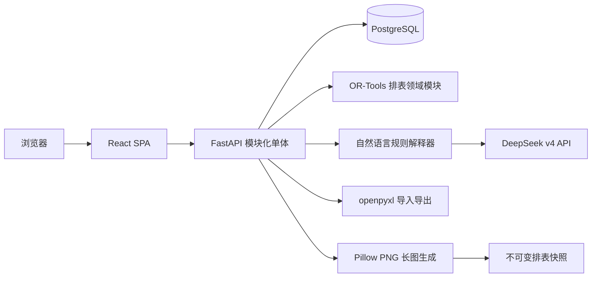
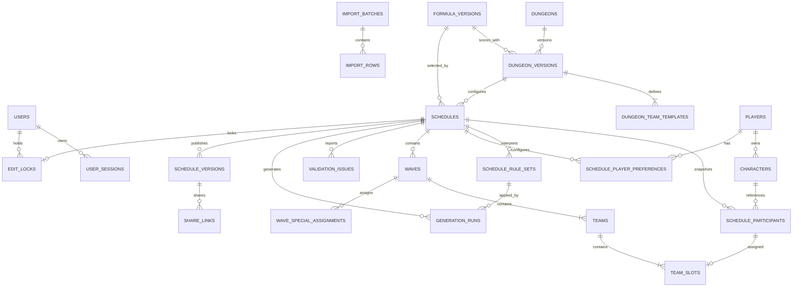
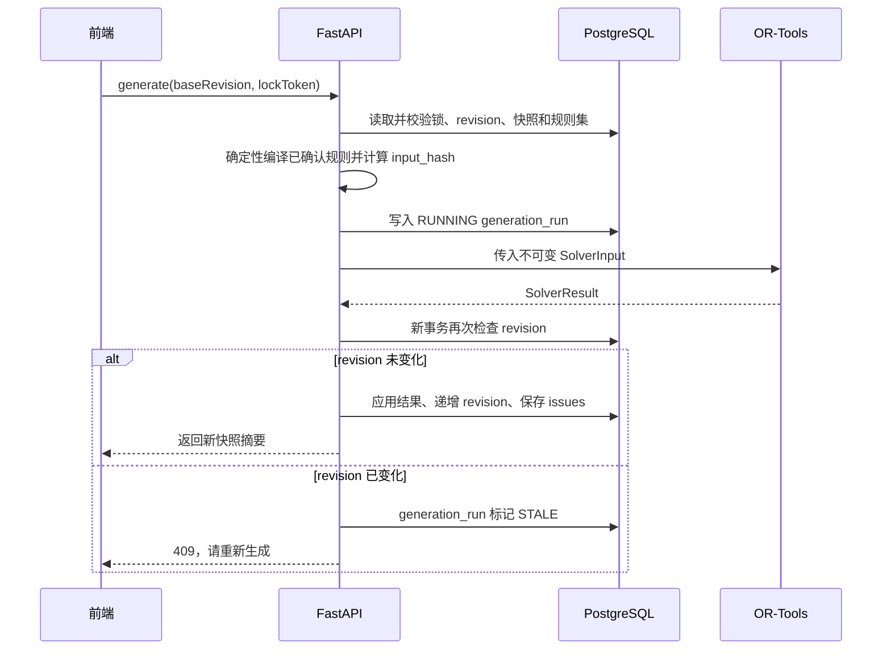
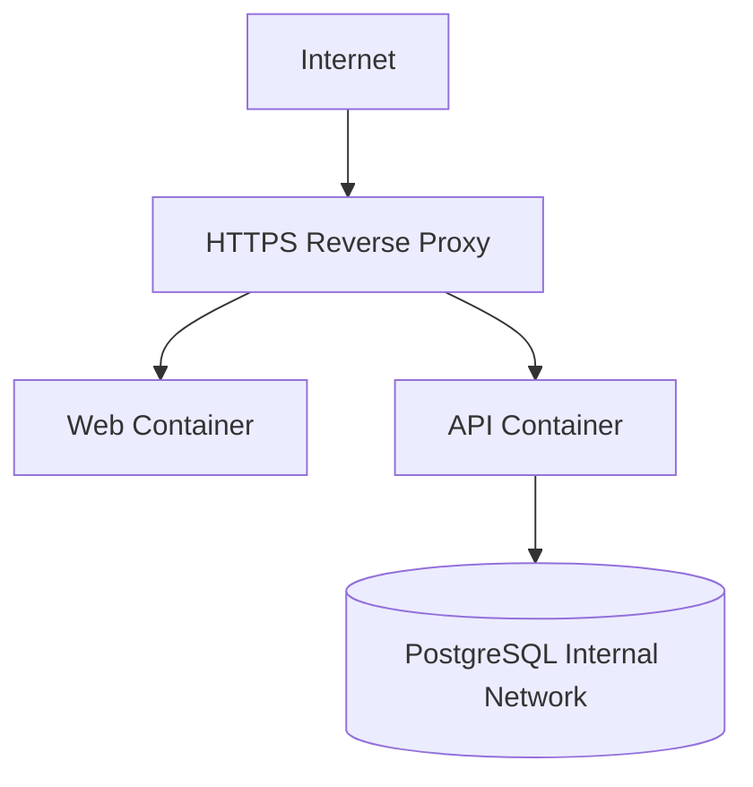

# DNF 团长排表工具技术设计文档

> 文档版本：v0.3
> 状态：技术评审稿  
> 依据文档：[DNF 团长排表工具设计文档](./design.md) v0.3
> 当前范围：副本管理、12 人团本排表和自然语言排表规则

## 1. 文档目标

本文把已确认的产品需求转化为可实施的技术方案，定义：

- 系统架构和模块边界。
- 前后端工程结构。
- PostgreSQL 数据模型、约束和索引。
- HTTP API 和并发控制协议。
- OR-Tools 智能排表模型。
- Excel、长图、版本和分享实现。
- 测试、部署、备份和安全方案。

本文不重复解释业务背景；业务规则以需求文档为准。出现冲突时，先修订需求文档，再同步修改本文。

## 2. 设计原则

1. **模块化单体优先**：MVP 使用一个 FastAPI 后端进程，不拆微服务。
2. **排表聚合强一致**：一次移动、交换、生成、复制或发布必须在数据库事务中完整成功或完整失败。
3. **服务端是规则真源**：前端可以即时提示，但最终校验由后端完成。
4. **历史不可变**：发布版本保存完整快照，不受人员池后续修改影响。
5. **求解器可替换**：OR-Tools 只依赖稳定的输入/输出模型，不直接操作数据库或 HTTP 对象。
6. **可解释优先**：算法除了返回结果，还要返回未分配原因、未满足目标和求解摘要。
7. **本地与公网同构**：本地和公网都通过容器运行，只替换环境变量、入口代理和安全配置。
8. **参数可配置**：尚未最终确认的精度、求解时限和波数上限采用配置默认值，不写死在业务代码中。
9. **副本驱动排表**：人数、队伍、合法组成、强度顺序和特殊角色规则来自版本化副本配置，不使用全局常量。
10. **模型只做解释**：DeepSeek 只把自然语言翻译为白名单内的结构化规则；确定性校验、规则编译和 OR-Tools 才是排表执行真源。

## 3. 技术选型

| 领域 | 选择 | 说明 |
| --- | --- | --- |
| 前端框架 | React + TypeScript + Vite | 适合高交互单页管理工具 |
| UI 组件 | Ant Design | 人员表格、表单、上传、弹窗和状态提示 |
| 拖拽 | dnd-kit | 跨队伍、跨波次移动和排序 |
| HTTP 与服务端状态 | 原生 `fetch` 封装 + React state | 当前规模下直接管理请求、加载和刷新状态 |
| 编辑器状态 | Zustand | 视图波次和撤销恢复命令栈 |
| 后端 | FastAPI + Pydantic | HTTP API、数据校验和 OpenAPI |
| ORM | SQLAlchemy 2 + Alembic | PostgreSQL 访问和 Schema 迁移 |
| 智能排表 | OR-Tools CP-SAT | 约束满足和多目标优化 |
| 自然语言规则 | DeepSeek v4 + Provider Adapter | 仅解析本次排表要求，模型与提示词版本可追踪 |
| 数据库 | PostgreSQL | 事务、JSONB、约束和不可变版本快照 |
| Excel | openpyxl | `.xlsx` 模板、预览、导入和导出 |
| 长图 | Pillow | 根据版本化副本结构直接绘制 PNG 长图 |
| 容器 | Docker Compose | 本机和公网单机部署 |
| 测试 | pytest、Vitest、Playwright、隔离 Docker/PostgreSQL 冒烟与恢复测试 | 单元、集成、浏览器和全栈验收 |

依赖版本策略：初始化工程时选择兼容的稳定版本，并通过 `pnpm-lock.yaml`、`uv.lock` 和 Docker 镜像标签锁定。业务代码不依赖未固定的 `latest` 镜像。

## 4. 总体架构



### 4.1 MVP 进程

Docker Compose 包含三个常驻服务：

1. `web`：构建并提供 React 静态资源。
2. `api`：运行 FastAPI，同时包含 OR-Tools、openpyxl 和 Pillow 依赖。
3. `db`：运行 PostgreSQL 并挂载持久化卷。

MVP 不引入 Redis、消息队列和独立求解服务。默认 12 波求解采用同步请求并设置严格时间上限。若性能测试表明公网阶段需要异步化，可在不改变求解器接口的情况下增加 `worker` 服务。

自然语言规则解析仍由同一个 `api` 进程编排，通过可替换的 Provider Adapter 调用 DeepSeek v4，不新增常驻服务。外部调用只发生在团长显式点击“解析要求”时；规则确认、重复生成和历史查看不再次调用模型。

### 4.2 模块边界

```text
HTTP API
  ↓
Application Services
  ├── Personnel Service
  ├── Dungeon Service
  ├── Import Service
  ├── Schedule Service
  ├── Rule Interpretation Service
  ├── Rule Compilation Service
  ├── Validation Service
  ├── Generation Service
  ├── Version Service
  ├── Export Service
  └── Lock Service
        ↓
Domain
  ├── Schedule Aggregate
  ├── Dungeon Definition
  ├── Scoring Formula
  ├── Constraint Model
  ├── Schedule Rule Model
  └── Issue Codes
        ↓
Repositories / PostgreSQL
```

领域模块不得依赖 FastAPI、SQLAlchemy Session 或浏览器数据结构。Application Service 负责 DTO、事务、权限和领域模块编排。

## 5. 仓库结构

推荐使用单仓库：

```text
dnf/
├── frontend/
│   ├── src/
│   │   ├── app/                 # Router、Provider、全局配置
│   │   ├── api/                 # 生成的 API 类型和请求封装
│   │   ├── components/          # 通用组件
│   │   ├── features/
│   │   │   ├── auth/
│   │   │   ├── dungeons/
│   │   │   ├── personnel/
│   │   │   ├── imports/
│   │   │   ├── schedules/
│   │   │   ├── schedule-editor/
│   │   │   └── exports/
│   │   ├── pages/
│   │   ├── routes/
│   │   ├── stores/
│   │   ├── styles/
│   │   └── test/
│   ├── public/
│   ├── package.json
│   └── vite.config.ts
├── backend/
│   ├── app/
│   │   ├── api/v1/              # FastAPI 路由
│   │   ├── application/         # 用例服务和事务边界
│   │   ├── core/                # 配置、安全、日志、异常
│   │   ├── db/                  # Session、Base、迁移辅助
│   │   ├── domain/
│   │   │   ├── dungeon/
│   │   │   ├── personnel/
│   │   │   ├── schedule/
│   │   │   ├── scoring/
│   │   │   └── validation/
│   │   ├── models/              # SQLAlchemy 持久化模型
│   │   ├── repositories/
│   │   ├── schemas/             # API Pydantic DTO
│   │   ├── solver/              # OR-Tools 输入、模型和输出
│   │   ├── imports/             # Excel 模板及解析
│   │   ├── exports/             # Excel、文本、长图
│   │   └── main.py
│   ├── migrations/
│   ├── tests/
│   │   ├── unit/
│   │   ├── integration/
│   │   ├── solver/
│   │   └── fixtures/
│   ├── pyproject.toml
│   └── uv.lock
├── docs/
│   ├── design.md
│   └── technical-design.md
├── infra/
│   ├── web/
│   ├── api/
│   └── proxy/
├── scripts/
│   ├── backup.sh
│   ├── restore.sh
│   └── wait-for-db.sh
├── compose.yaml
├── compose.prod.yaml
├── .env.example
├── Makefile
└── README.md
```

`main.py` 示例文件在工程初始化阶段移除，由 `backend/app/main.py` 替代。

## 6. 前端设计

### 6.0 副本管理页面

副本管理采用“副本主体 + 版本”两层界面：

- 副本列表维护名称、编码和启用状态。
- 版本列表区分 DRAFT、PUBLISHED 和 RETIRED。
- 版本编辑器用队伍表格配置名称、颜色、顺序和人数。
- 合法组成使用结构化行编辑，不让用户直接修改 JSON。
- 特殊角色和强度顺序通过规则表单配置。
- 页面实时显示每波总人数、规则覆盖情况和发布错误。
- PUBLISHED 版本只读；“编辑”操作实际复制出下一版 DRAFT。
- 新建副本成功后直接打开首个版本编辑器；已有空副本也保留“创建首个草稿”入口，避免只有主体而无法继续配置。
- 版本编辑器按“波次与队伍 / 队伍组成 / 自动排表规则”分区，使用 `Form.List` 维护任意数量队伍和组成规则；`displayOrder` 来自队伍列表顺序。C 与奶的强度顺序分别编辑并按选择顺序无损回写 `strengthOrderRules`，不从 `strengthRank` 推导，也不写死队伍键；`strengthRank` 只用于标识固定主队规则的目标队伍。
- 评分公式在当前编辑器中只读，创建首个 12 人团本草稿使用 `TEAM_SCORE v2`，复制版本则保留来源公式快照。
- 保存前执行轻量的队伍标识、强度排名、组成容量和规则覆盖检查，服务端 `DungeonVersionDefinition` 仍是最终规则真源。
- 版本历史提供只读查看、复制草稿、显式校验、发布和退役；所有写入口继续按 Owner/Editor 权限禁用，Viewer 保持只读。

内置 12 人团本使用同一数据结构和页面展示，不在前端写特殊页面分支。

#### 6.0.1 自然语言排表规则

自然语言入口放在排表生成区，而不是副本版本的执行配置中。前端采用“输入 → 解析预览 → 确认生效 → 自动生成”四步状态：

- 输入框标题为“本次排表要求”，显示长度限制和不会修改副本规则的提示。
- 解析预览按硬规则、软目标、歧义、冲突和不支持内容分组，所有玩家、角色、队伍和波次引用同时显示名称与已解析实体。
- 有歧义、未知引用、不支持项或硬冲突时禁用确认；允许团长修改原文后重新解析。
- 已确认规则使用紧凑标签展示，修改原文会产生新解析记录，旧规则继续生效直到新规则确认或被明确停用。
- 生成结果展示每条规则的 `SATISFIED/UNSATISFIED/BLOCKED/NOT_APPLICABLE` 状态和确定性说明，不在浏览器重新解释模型文本。
- Viewer 只读；Owner/Editor 的解析、确认和停用操作均要求有效编辑租约及最新 `baseRevision`。

副本编辑器后续可以复用同一解析组件作为结构化表单填写助手，但保存和发布的仍是 `DungeonVersionDefinition`，不会让自然语言绕过版本校验。

### 6.1 当前导航与公开路由

```text
/
/share/:token
```

当前管理端未引入 React Router：登录后在 `/` 内通过页签状态切换副本、人员和排表模块；
`/share/:token` 根据 URL token 渲染公开只读排表。PNG、Excel 和文本由 API 直接生成下载，
不存在前端打印路由。阶段 5 若增加更复杂的账号权限或深链接，再评估引入正式路由层。

### 6.2 状态分层

#### 服务端状态

统一 `api<T>` fetch 封装与页面 React state 管理：

- 玩家和角色列表。
- 排表列表、参团快照和历史版本。
- 导入批次。
- 校验报告和生成记录。

#### 编辑器本地状态

Zustand 当前管理：

- 总览/单波视图模式和当前波次。
- 已确认编辑命令的撤销/恢复栈。

拖拽乐观布局和页面表单状态由页面组件管理；多用户单编辑会话锁与心跳属于阶段 5，
当前 Zustand store 尚不维护这类状态。

服务端保存成功后，以返回的 `revision` 和受影响波次覆盖本地确认态。

### 6.3 编辑器数据结构

前端使用一个聚合快照加载编辑器：

```ts
interface ScheduleEditorSnapshot {
  schedule: ScheduleSummary;
  participants: ScheduleParticipant[];
  waves: WaveView[];
  unassigned: UnassignedParticipant[];
  issues: ValidationIssue[];
  formula: FormulaSummary;
  revision: number;
  lock: EditLockView;
}
```

角色卡片使用 `scheduleParticipantId` 作为拖拽 ID，不使用角色名，避免重名和历史快照变化造成标识不稳定。

`WaveView.teams` 来自排表保存的副本队伍快照，并按 `displayOrder` 渲染为自适应 CSS Grid。前端不得假定永远只有红、黄、绿三队，也不得假定每队永远四个位置。

### 6.4 编辑命令

拖拽和按钮操作统一转换为命令：

```text
MOVE_PARTICIPANT
SWAP_PARTICIPANTS
UNASSIGN_PARTICIPANT
SET_WAVE_CORE
LOCK_PARTICIPANT
LOCK_SLOT
LOCK_WAVE
UNLOCK_*
```

命令包含 `operationId`、`baseRevision` 和操作参数。前端可先乐观更新；服务器拒绝时回滚并显示原因。

撤销操作不直接恢复整张旧快照，而是提交对应的逆命令。发布版本负责跨刷新和长期恢复，内存命令栈负责当前编辑会话的快速撤销。

### 6.5 即时校验

前端实现轻量、纯展示型校验：

- 同玩家同波。
- 角色类型和队伍人数。
- 红黄绿分数。
- 秘宝 C 是否位于红队。
- 待补数量。

后端返回的校验结果拥有最终权威。前端不得仅凭本地校验决定发布成功。

### 6.6 大排表性能

- 总览视图按波次拆分组件，角色卡片使用稳定 memo 边界。
- 超过配置阈值后启用纵向虚拟化。
- 拖拽期间只更新源队、目标队和强度摘要。
- 强度计算使用派生选择器，不全量重建编辑器状态。
- 长图导出由后端按版本化副本结构绘制，不依赖虚拟化页面截图。

## 7. 后端设计

### 7.1 请求生命周期

```text
Router
→ 身份和权限依赖
→ 编辑锁/版本检查
→ Pydantic 参数校验
→ Application Service
→ Domain Validation / Solver
→ Repository
→ Transaction Commit
→ Response DTO
```

### 7.2 数据库访问

MVP 使用 SQLAlchemy 2 的同步 Session：

- 业务规模小，同步模型更容易控制事务。
- OR-Tools 是 CPU 密集型，使用异步数据库不会改善求解性能。
- FastAPI 通过工作线程执行同步依赖。

每个 Application Service 明确开启事务。Repository 不自行提交事务。

### 7.3 错误模型

所有 API 错误采用统一结构：

```json
{
  "error": {
    "code": "SCHEDULE_REVISION_CONFLICT",
    "message": "排表已被其他操作修改，请刷新后重试",
    "path": "schedule.revision",
    "details": {
      "expected": 18,
      "actual": 19
    },
    "traceId": "..."
  }
}
```

错误码稳定、消息可本地化。前端业务逻辑只判断 `code`，不解析中文消息。

## 8. PostgreSQL 数据设计

### 8.1 通用约定

- 主键使用 UUID。
- 时间使用 `timestamptz`，统一保存 UTC。
- 金额式精确数据使用 `numeric`，不使用浮点数。
- 业务枚举优先使用 `varchar + check constraint`，降低数据库枚举迁移成本。
- 业务记录默认软停用；历史版本永不级联删除。
- JSONB 只用于版本快照、公式配置、导入预览和诊断详情；核心关系仍采用结构化列。
- 所有外键和高频筛选列建立明确索引。

### 8.2 表关系



### 8.3 副本定义和版本

#### `dungeons`

| 列 | 类型 | 约束/说明 |
| --- | --- | --- |
| `id` | uuid | PK |
| `code` | varchar(80) | unique, not null，稳定业务编码 |
| `name` | varchar(120) | not null |
| `description` | text | 可空 |
| `is_active` | boolean | default true |
| `created_at` | timestamptz | not null |
| `updated_at` | timestamptz | not null |

`code` 发布后不可修改。停用副本只阻止新建排表，已有排表仍然可读和复制。

#### `dungeon_versions`

| 列 | 类型 | 约束/说明 |
| --- | --- | --- |
| `id` | uuid | PK |
| `dungeon_id` | uuid | FK dungeons |
| `version_no` | integer | 同副本内递增 |
| `status` | varchar(16) | `DRAFT/PUBLISHED/RETIRED` |
| `default_wave_count` | smallint | 大于 0 |
| `min_wave_count` | smallint | 大于 0 |
| `max_wave_count` | smallint | 可空，且不小于 min |
| `formula_version_id` | uuid | FK formula_versions |
| `composition_rules` | jsonb | 允许构成及优先级 |
| `special_role_rules` | jsonb | 秘宝 C 等特殊规则 |
| `strength_order_rules` | jsonb | 队伍强度偏序及指标 |
| `optimization_rules` | jsonb | 跨波平衡和偏好目标开关 |
| `missing_slot_policy` | jsonb | 待补和波次填充策略 |
| `created_by` | uuid | FK users |
| `created_at` | timestamptz | not null |
| `published_at` | timestamptz | 可空 |

unique `(dungeon_id, version_no)`。PUBLISHED 版本不可更新；变更时复制为新 DRAFT 版本，发布后供新排表选择。

规则 JSON 使用带版本的明确 Schema，而不是自由文本。下例是 Application DTO 和版本快照中的组合视图；持久化时各顶层字段分别进入对应 JSONB 列。内置 12 人团本示例：

```json
{
  "compositionRules": {
    "schemaVersion": 1,
    "allowed": [
      {
        "code": "3D1B",
        "applicableTeamKeys": ["RED", "YELLOW", "GREEN"],
        "roles": {"DAMAGE": 3, "BUFFER": 1},
        "priority": 1
      },
      {
        "code": "2D2B",
        "applicableTeamKeys": ["RED", "YELLOW", "GREEN"],
        "roles": {"DAMAGE": 2, "BUFFER": 2},
        "priority": 2
      }
    ]
  },
  "specialRoleRules": {
    "schemaVersion": 1,
    "rules": [
      {
        "code": "TREASURE_DAMAGE_CORE",
        "characterFlag": "TREASURE_DAMAGE",
        "countPerWave": 1,
        "targetTeamKey": "RED",
        "requiredForCompleteWave": true,
        "companionPolicy": {
          "roleType": "DAMAGE",
          "objective": "MINIMIZE_OTHER_MEMBER_SCORE"
        }
      }
    ]
  },
  "strengthOrderRules": {
    "schemaVersion": 1,
    "orders": [
      {"metric": "DAMAGE", "teams": ["RED", "YELLOW", "GREEN"]},
      {"metric": "BUFFER", "teams": ["RED", "YELLOW", "GREEN"]}
    ]
  },
  "optimizationRules": {
    "schemaVersion": 1,
    "balanceAcrossWaves": ["DAMAGE", "BUFFER"],
    "respectPlayerPreferences": true
  },
  "missingSlotPolicy": {
    "schemaVersion": 1,
    "mode": "FILL_EARLIER_WAVES"
  }
}
```

#### `dungeon_team_templates`

| 列 | 类型 | 约束/说明 |
| --- | --- | --- |
| `id` | uuid | PK |
| `dungeon_version_id` | uuid | FK dungeon_versions |
| `team_key` | varchar(40) | 版本内稳定标识，如 RED |
| `display_name` | varchar(80) | 如红队 |
| `display_color` | varchar(20) | 设计令牌或颜色值 |
| `display_order` | smallint | 页面顺序 |
| `member_count` | smallint | 大于 0 |
| `strength_rank` | smallint | 可空，越小越强 |

unique `(dungeon_version_id, team_key)` 和 `(dungeon_version_id, display_order)`。

每波人数始终由 `SUM(member_count)` 计算。发布副本版本时必须验证：

- 至少一个队伍。
- 队伍人数及总人数不超过系统安全上限。
- 每个队伍至少有一条适用组成规则，且规则人数之和等于该队伍容量。
- 特殊角色规则引用存在的 team_key 和角色标志。
- 已填写的 `strength_rank` 唯一；同一强度指标最多一条顺序规则，且每条规则引用至少一支存在且不重复的队伍。
- 组成规则和特殊角色规则的 code 各自在版本内唯一；单条组成规则的适用队伍不得重复。
- 优化规则和待补策略使用当前支持的 schemaVersion 和枚举值。
- 默认波数处于允许范围。

该模型可以表达单队 4 人等结构，但当前只交付通用副本配置和 12 人团本自动排表；军团本人工互带页面和专用规则仅作为长期 TODO 保留，不属于当前重点或已排期模块。

### 8.4 用户与会话

#### `users`

| 列 | 类型 | 约束 |
| --- | --- | --- |
| `id` | uuid | PK |
| `username` | varchar(80) | unique, not null |
| `password_hash` | text | not null |
| `role` | varchar(16) | `OWNER/EDITOR/VIEWER` |
| `is_active` | boolean | default true |
| `created_at` | timestamptz | not null |
| `updated_at` | timestamptz | not null |

#### `user_sessions`

保存服务端会话令牌的哈希，不保存明文令牌。包含 `user_id`、`token_hash`、`expires_at`、`last_seen_at` 和撤销状态。

本地首次启动通过初始化命令创建 Owner，不在镜像中硬编码默认密码。

### 8.5 玩家与角色

#### `players`

| 列 | 类型 | 约束 |
| --- | --- | --- |
| `id` | uuid | PK |
| `display_name` | varchar(120) | not null |
| `display_name_key` | varchar(120) | unique, not null |
| `is_active` | boolean | default true |
| `sort_order` | integer | not null，持久化玩家显示顺序 |
| `created_at` | timestamptz | not null |
| `updated_at` | timestamptz | not null |

`display_name_key` 是去除首尾空格并统一大小写后的匹配键，供 Excel 导入使用；页面仍展示原始 `display_name`。

#### `characters`

| 列 | 类型 | 约束 |
| --- | --- | --- |
| `id` | uuid | PK |
| `player_id` | uuid | FK players, not null |
| `name` | varchar(120) | not null，历史兼容内部字段，不对外录入或展示 |
| `name_key` | varchar(120) | not null，保存规范化职业键 |
| `profession` | varchar(80) | not null |
| `role_type` | varchar(16) | `DAMAGE/BUFFER` |
| `damage_score` | numeric(14,2) | 可空，单位亿 |
| `buffer_score` | numeric(8,2) | 可空 |
| `is_treasure_damage` | boolean | default false |
| `is_fixed_lead_team_buffer` | boolean | default false，仅奶可设置 |
| `is_group_hunt` | boolean | default false，仅 C 可设置 |
| `default_raid_participant` | boolean | default false |
| `note` | text | 可空，历史兼容字段，不在人员页面录入或展示 |
| `is_active` | boolean | default true |
| `sort_order` | integer | not null，持久化所属玩家内的角色显示顺序 |
| `created_at` | timestamptz | not null |
| `updated_at` | timestamptz | not null |

约束：

- unique `(player_id, name_key)`；`name_key` 使用规范化职业，确保同一玩家不能拥有重复职业。
- `DAMAGE` 必须有 `damage_score`，且 `buffer_score` 为空。
- `BUFFER` 必须有 `buffer_score`，且 `damage_score` 为空。
- 只有 `DAMAGE` 可以设置 `is_treasure_damage=true`。
- 只有 `BUFFER` 可以设置 `is_fixed_lead_team_buffer=true`。
- 只有 `DAMAGE` 可以设置 `is_group_hunt=true`。
- 两类评分都必须大于等于 0。

人员列表先按 `sort_order` 排序，再使用规范化名称或创建时间和 ID 保证旧数据及并列值的稳定顺序。手动新建的玩家、角色追加到各自作用域末尾；Excel 确认导入按数据行首次出现顺序重排导入范围，未出现在表格中的既有玩家和角色保持原相对顺序并置于导入项之后。迁移旧数据时分别保留原玩家名称顺序和角色创建顺序。

### 8.6 公式版本

#### `formula_versions`

| 列 | 类型 | 说明 |
| --- | --- | --- |
| `id` | uuid | PK |
| `code` | varchar(40) | 例如 `TEAM_SCORE_V1` |
| `version` | integer | 同 code 递增 |
| `config` | jsonb | 精度、2C2奶策略等 |
| `is_active` | boolean | 是否可供新排表选择 |
| `created_at` | timestamptz | 创建时间 |

`code + version` 唯一。已被排表引用的公式版本不可修改，只能创建新版本。

首期配置示例：

```json
{
  "damageUnit": "YI",
  "damageScale": 100,
  "bufferScale": 10,
  "teamDamageMode": "SUM",
  "twoBufferMode": "SUM"
}
```

### 8.7 排表主体

#### `schedules`

| 列 | 类型 | 约束/说明 |
| --- | --- | --- |
| `id` | uuid | PK |
| `name` | varchar(160) | not null |
| `dungeon_version_id` | uuid | FK dungeon_versions，not null |
| `wave_count` | smallint | 大于 0，受配置安全上限约束 |
| `status` | varchar(16) | `DRAFT/PUBLISHED/ARCHIVED` |
| `formula_version_id` | uuid | FK formula_versions |
| `note` | text | 可空 |
| `active_rule_set_id` | uuid | 可空，FK schedule_rule_sets；当前已确认规则集 |
| `revision` | integer | 乐观并发版本，默认 1 |
| `last_published_version` | integer | 可空 |
| `validation_summary` | jsonb | 当前 revision 的摘要 |
| `created_by` | uuid | FK users |
| `updated_by` | uuid | FK users |
| `created_at` | timestamptz | not null |
| `updated_at` | timestamptz | not null |

修改排表聚合内任何数据都必须递增 `revision`。

状态转换约定：

```text
新建/复制 → DRAFT
DRAFT 发布 → PUBLISHED
PUBLISHED 继续编辑/恢复版本 → DRAFT（已发布版本仍保留）
DRAFT 或 PUBLISHED 归档 → ARCHIVED
```

`PUBLISHED` 表示当前草稿已与最近发布版本一致；继续编辑只改变当前状态，不修改任何历史版本。

新建排表只能引用 PUBLISHED 副本版本。创建事务根据该版本一次性生成全部 wave、team 和 slot，并把队伍展示及容量字段写入快照。副本版本后来退休不影响已有排表。

`schedules.formula_version_id` 在创建时复制自 `dungeon_versions.formula_version_id`，作为排表快照的一部分；首期不允许排表绕过副本版本单独切换公式。

#### `schedule_rule_sets`

| 列 | 类型 | 说明 |
| --- | --- | --- |
| `id` | uuid | PK |
| `schedule_id` | uuid | FK schedules，not null |
| `input_revision` | integer | 解析时的排表 revision |
| `source_text` | text | 团长输入的原文 |
| `source_hash` | char(64) | 规范化原文哈希 |
| `context_hash` | char(64) | 参团实体、波数、副本队伍和规则能力目录哈希 |
| `status` | varchar(16) | `PARSED/CONFIRMED/STALE/SUPERSEDED/FAILED` |
| `model_provider` | varchar(40) | 首期为 `DEEPSEEK` |
| `model_name` | varchar(120) | 首期配置别名为 `deepseek-v4`，保存调用时解析到的实际标识 |
| `provider_response_id` | varchar(160) | 可空，供应商请求追踪标识 |
| `prompt_version` | varchar(40) | 系统提示词模板版本 |
| `schema_version` | integer | 结构化规则 Schema 版本 |
| `parsed_rules` | jsonb | 通过 Pydantic Schema 校验的模型输出 |
| `resolved_references` | jsonb | 玩家、角色、队伍和波次引用快照 |
| `issues` | jsonb | 歧义、冲突、不支持项和解析失败摘要 |
| `created_by` | uuid | FK users |
| `confirmed_by` | uuid | 可空，FK users |
| `created_at` | timestamptz | not null |
| `confirmed_at` | timestamptz | 可空 |

规则集确认后不可原地修改。确认事务锁定排表，校验 `baseRevision`、编辑租约、`source_hash`、`context_hash` 和全部引用，把旧 `CONFIRMED` 规则集改为 `SUPERSEDED`，再更新 `schedules.active_rule_set_id` 并递增 revision。使用部分唯一索引保证每张排表至多一个 `CONFIRMED` 规则集。解析记录允许保留失败摘要，但不保存供应商隐式推理过程。

影响解释语义的参团人员、波数或副本结构发生变化时，将当前规则集标记为 `STALE` 并清空 `active_rule_set_id`；团长可保留原文重新解析。拖拽位置和锁定变化不改变 `context_hash`，生成前由确定性编译器检查其与规则的冲突。复制排表只把原文作为待解析输入带入，不复制已确认状态或解析引用。

#### `schedule_participants`

排表使用角色快照，而不是实时读取人员池：

| 列 | 类型 | 说明 |
| --- | --- | --- |
| `id` | uuid | PK |
| `schedule_id` | uuid | FK schedules |
| `character_id` | uuid | FK characters |
| `player_id_snapshot` | uuid | 玩家引用快照 |
| `player_name_snapshot` | varchar(120) | 展示快照 |
| `character_name_snapshot` | varchar(120) | 展示快照 |
| `profession_snapshot` | varchar(80) | 职业快照 |
| `role_type_snapshot` | varchar(16) | 类型快照 |
| `damage_score_snapshot` | numeric(14,2) | C 评分快照 |
| `buffer_score_snapshot` | numeric(8,2) | 奶评分快照 |
| `is_treasure_snapshot` | boolean | 秘宝 C 快照 |
| `is_fixed_lead_team_buffer_snapshot` | boolean | 固定最高强度队伍奶快照 |
| `is_group_hunt_snapshot` | boolean | 群猎标记快照 |
| `is_selected` | boolean | 当前是否参加该排表 |
| `is_locked` | boolean | 重新生成时锁定角色 |
| `unassigned_reason` | jsonb | 最近一次未分配诊断 |

unique `(schedule_id, character_id)`。复制排表时重新从 `characters` 获取快照值。

#### `schedule_player_preferences`

| 列 | 类型 | 说明 |
| --- | --- | --- |
| `schedule_id` | uuid | 复合 PK |
| `player_id` | uuid | 复合 PK |
| `allowed_waves` | smallint[] | NULL 表示全波次，空数组表示没有可用波次 |
| `max_wave_count` | smallint | 可空表示不额外限制 |
| `prefer_early` | boolean | 软偏好 |
| `prefer_contiguous` | boolean | 软偏好 |

保存前校验数组去重、升序且所有波次位于 `1..wave_count`。使用 NULL 和空数组区分“全程可用”与“全程不可用”，避免语义歧义。

### 8.8 波次、队伍与位置

#### `waves`

- `id`
- `schedule_id`
- `wave_no`
- `is_locked`
- `damage_total`
- `buffer_total`

unique `(schedule_id, wave_no)`。

#### `teams`

- `id`
- `schedule_id`
- `wave_id`
- `team_key`：来自副本版本，如 `RED/YELLOW/GREEN`。
- `display_name_snapshot`。
- `display_color_snapshot`。
- `display_order_snapshot`。
- `member_count_snapshot`。
- `strength_rank_snapshot`。
- `damage_total`
- `buffer_total`
- `composition_code`：命中的副本组成规则 code，或 `INCOMPLETE/INVALID`。

unique `(wave_id, team_key)`。队伍名称、颜色、人数和顺序保存快照，页面和导出不实时读取后来发布的新副本版本。

#### `wave_special_assignments`

- `id`
- `schedule_id`
- `wave_id`
- `rule_code`：来自 `special_role_rules`。
- `participant_id`：被选中的特殊角色。
- `target_team_key_snapshot`。

unique `(wave_id, rule_code, participant_id)`。内置 12 人团本通过 `TREASURE_DAMAGE_CORE` 规则表达每波核心秘宝 C，不在通用 wave 表中硬编码秘宝字段。

#### `team_slots`

- `id`
- `schedule_id`
- `wave_id`
- `team_id`
- `slot_no`：1..当前队伍的 `member_count_snapshot`。
- `participant_id`：可空，空即“待补”。
- `is_locked`

约束和索引：

- unique `(team_id, slot_no)`。
- unique `participant_id`；PostgreSQL 允许多个 NULL，因此同一参团角色最多出现在一个位置。
- index `(schedule_id, wave_id)`。
- Application Service 校验 participant、wave、team 都属于同一 schedule。

降低波数时，如果被删除波次含已分配或锁定角色，API 必须要求二次确认；角色移回未分配池，不删除参团快照。

### 8.9 校验与求解记录

#### `validation_issues`

- `id`
- `schedule_id`
- `revision`
- `severity`：`INFO/WARNING/ERROR`。
- `code`：稳定错误码。
- `scope_type`：`SCHEDULE/WAVE/TEAM/PARTICIPANT/PLAYER/SLOT`。
- `scope_id`
- `message_params`：jsonb。
- `details`：jsonb。

每次服务端校验后替换当前 revision 的 issue 集合。历史发布版本在快照中保存当时 issues，不依赖此表。

#### `generation_runs`

- `id`
- `schedule_id`
- `input_revision`
- `result_revision`
- `status`：`RUNNING/SUCCEEDED/PARTIAL/FAILED/STALE`。
- `input_hash`
- `solver_version`
- `formula_version_id`
- `schedule_rule_set_id`：可空，FK schedule_rule_sets
- `rule_compiler_version`
- `effective_rules`：jsonb，实际传入求解器的确定性规则快照
- `random_seed`
- `time_limit_seconds`
- `duration_ms`
- `objective_summary`：jsonb。
- `diagnostics`：jsonb。
- `rule_evaluation`：jsonb，每条自然语言规则的满足状态和说明。
- `created_by`
- `created_at`
- `finished_at`

### 8.10 发布版本和分享

#### `schedule_versions`

- `id`
- `schedule_id`
- `version_no`
- `source_revision`
- `snapshot_schema_version`
- `snapshot`：jsonb，完整不可变排表。
- `snapshot_hash`
- `formula_version_id`
- `published_by`
- `published_at`

unique `(schedule_id, version_no)`。发布后禁止 UPDATE 和 DELETE，归档只改变 schedule 状态。

发布快照包含当前确认规则集的原文、结构化规则、引用快照、编译器版本和最近一次规则满足状态；不包含 API Key、供应商隐式推理或未经确认的解析记录。后续替换当前排表规则集不会改变已发布版本。

除应用层限制外，生产迁移应创建数据库触发器拒绝对 `schedule_versions` 的 UPDATE 和 DELETE，确保历史快照不可变。

#### `share_links`

- `id`
- `schedule_version_id`
- `token_hash`
- `expires_at`：可空。
- `revoked_at`：可空。
- `created_by`
- `created_at`

数据库只保存分享令牌哈希。令牌只在创建响应中返回一次。

### 8.11 编辑锁

#### `edit_locks`

- `schedule_id`：PK/FK。
- `user_id`。
- `lock_token_hash`。
- `acquired_at`。
- `heartbeat_at`。
- `expires_at`。

获取锁使用单条事务：

1. 对目标行加行锁。
2. 无锁或已过期时写入新持有者和令牌。
3. 未过期且持有者不同则返回 `423 Locked`。

修改排表同时要求：有效锁令牌 + 正确 `baseRevision`。

### 8.12 Excel 导入暂存

#### `import_batches`

保存文件名、创建者、状态、总行数、摘要和过期时间。

#### `import_rows`

保存行号、规范化 payload、匹配到的玩家/角色、动作 `CREATE/UPDATE/IGNORE/ERROR` 和错误列表。

导入确认后在一个事务中写入人员数据，按暂存行顺序更新玩家和角色的 `sort_order`，并把批次标记为 `COMMITTED`。即使某行内容为 `IGNORE`，也参与顺序计算；未出现在导入文件中的既有记录保持相对顺序并追加在导入项之后。过期未确认批次可以安全清理。

## 9. API 设计

API 前缀为 `/api/v1`，请求和响应使用 JSON；文件接口除外。

### 9.1 副本管理

```text
GET    /dungeons
POST   /dungeons
GET    /dungeons/{dungeonId}
PATCH  /dungeons/{dungeonId}
POST   /dungeons/{dungeonId}/versions
GET    /dungeons/{dungeonId}/versions
GET    /dungeon-versions/{versionId}
PATCH  /dungeon-versions/{versionId}
POST   /dungeon-versions/{versionId}/validate
POST   /dungeon-versions/{versionId}/publish
POST   /dungeon-versions/{versionId}/retire
```

只有 DRAFT 副本版本允许修改。`publish` 在事务中完成完整规则校验并将版本设为不可变。

### 9.2 身份

```text
POST   /auth/login
POST   /auth/logout
GET    /auth/me
```

### 9.3 人员和角色

```text
GET    /players
POST   /players
PUT    /players/reorder
GET    /players/{playerId}
PATCH  /players/{playerId}
POST   /players/{playerId}/characters
PUT    /players/{playerId}/characters/reorder
PATCH  /characters/{characterId}
POST   /characters/{characterId}/deactivate
POST   /characters/batch-update
```

列表接口支持分页、搜索和 `roleType/isTreasure/defaultParticipant/isActive` 筛选。玩家和角色分别使用持久化的 `sort_order` 升序返回；两个排序接口接收当前作用域的完整 ID 顺序并在事务中更新，列表集合已变化时返回 409，避免局部或过期页面覆盖顺序。

### 9.4 Excel 导入

```text
GET    /imports/characters/template
POST   /imports/characters/preview
GET    /imports/characters/{batchId}
POST   /imports/characters/{batchId}/commit
GET    /imports/characters/{batchId}/errors.xlsx
```

`preview` 返回批次 ID 和摘要，不直接修改人员池。

### 9.5 排表主体

```text
GET    /schedules
POST   /schedules
GET    /schedules/{scheduleId}
PATCH  /schedules/{scheduleId}
POST   /schedules/{scheduleId}/copy/preview
POST   /schedules/{scheduleId}/copy
POST   /schedules/{scheduleId}/archive
GET    /schedules/{scheduleId}/editor
PUT    /schedules/{scheduleId}/participants
PUT    /schedules/{scheduleId}/player-preferences
POST   /schedules/{scheduleId}/sync-characters/preview
POST   /schedules/{scheduleId}/sync-characters/commit
```

创建排表请求必须包含 `dungeonVersionId`；未传波数时使用副本版本的 `defaultWaveCount`。复制请求可以选择保留原版本或迁移到同副本的另一个 PUBLISHED 版本，迁移时先返回结构差异预览。复制确认必须回传预览指纹和 `baseRevision`；服务端锁定源排表并重新计算指纹，避免使用过期结构创建副本。预检查同样携带 `baseRevision`，仅在 revision 未变化时保存该版本的摘要。

### 9.6 编辑命令

```text
POST   /schedules/{scheduleId}/commands
```

示例：

```json
{
  "operationId": "uuid",
  "baseRevision": 18,
  "operations": [
    {
      "type": "MOVE_PARTICIPANT",
      "participantId": "uuid",
      "toSlotId": "uuid"
    }
  ]
}
```

响应返回：

- 新 `revision`。
- 被修改的波次。
- 未分配池变化。
- 最新 issues。
- 每个操作的逆命令，供前端撤销。

相同 `operationId` 重试时返回第一次的结果，避免网络重试造成重复移动。

### 9.7 校验和自动生成

```text
POST   /schedules/{scheduleId}/validate
POST   /schedules/{scheduleId}/rule-sets/parse
GET    /schedules/{scheduleId}/rule-sets
POST   /schedules/{scheduleId}/rule-sets/{ruleSetId}/confirm
POST   /schedules/{scheduleId}/rule-sets/clear
POST   /schedules/{scheduleId}/generate
GET    /schedules/{scheduleId}/generation-runs
GET    /generation-runs/{runId}
```

解析请求携带 `sourceText` 和 `baseRevision`。服务端构造最小化上下文，调用 DeepSeek v4，随后依次执行 Pydantic Schema 校验、名称解析、白名单检查和规则冲突检查。解析响应仅供预览，不会自动设为生效规则。

`confirm` 和 `clear` 是排表聚合写操作，必须携带 `baseRevision`、有效编辑租约和当前规则集哈希。解析依据的人员、队伍或波次上下文已变化时返回 `409 RULE_SET_CONTEXT_STALE`，要求重新解析。模型调用在数据库事务外完成，不长时间占用排表锁。

生成请求：

```json
{
  "baseRevision": 18,
  "preserveLocks": true,
  "expectedRuleSetId": "uuid-or-null",
  "randomSeed": 42,
  "timeLimitSeconds": 10
}
```

`timeLimitSeconds` 的默认值来自服务端配置；客户端只能在允许范围内选择。

`expectedRuleSetId` 必须与排表当前生效规则集一致，防止用户预览后规则被另一个操作替换却继续生成。没有确认规则集时显式传 `null`。

### 9.8 发布、历史和分享

```text
POST   /schedules/{scheduleId}/publication-check
POST   /schedules/{scheduleId}/publish
GET    /schedules/{scheduleId}/versions
GET    /schedules/{scheduleId}/versions/{versionNo}
POST   /schedules/{scheduleId}/versions/{versionNo}/restore-as-draft
POST   /schedules/{scheduleId}/versions/{versionNo}/copy-as-draft
POST   /schedule-versions/{versionId}/share-links
GET    /schedule-versions/{versionId}/share-links
DELETE /share-links/{shareLinkId}
GET    /share/{token}
```

发布请求携带已确认的 issue IDs。结构完整但存在业务警告时，团长确认后仍可发布；数据库结构性冲突始终禁止发布。

### 9.9 导出

```text
GET    /schedule-versions/{versionId}/exports/image
GET    /schedule-versions/{versionId}/exports/excel
GET    /schedule-versions/{versionId}/exports/text
GET    /schedules/{scheduleId}/exports/image
GET    /schedules/{scheduleId}/exports/excel
GET    /schedules/{scheduleId}/exports/text
```

草稿导出使用单独接口并强制“草稿”水印。

### 9.10 编辑锁

```text
POST   /schedules/{scheduleId}/lock
POST   /schedules/{scheduleId}/lock/heartbeat
DELETE /schedules/{scheduleId}/lock
POST   /schedules/{scheduleId}/lock/takeover
```

写请求通过 `X-Edit-Lock-Token` 传递锁令牌，并在请求体中带 `baseRevision`。
当前实现使用 90 秒默认租期和 30 秒默认心跳。令牌明文只返回给获取或接管租约的
浏览器标签页，数据库仅保存 SHA-256 哈希；排表写依赖在同一事务中锁定租约行，
自动排表求解提交结果前会再次验证租约。Viewer 以及未持有租约的 Owner/Editor
仍可查看排表、历史、预检查和导出，但前端禁用修改控件。

## 10. 排表并发与事务

### 10.1 乐观版本

所有排表写操作执行：

```sql
UPDATE schedules
SET revision = revision + 1, updated_at = now()
WHERE id = :id AND revision = :base_revision;
```

受影响行数为 0 时返回 `409 SCHEDULE_REVISION_CONFLICT`。

### 10.2 生成期间的竞争

求解过程不长时间持有数据库事务：



生成事务准备阶段还必须比较请求的 `expectedRuleSetId`、排表当前 `active_rule_set_id` 和编译上下文哈希。任一不一致都在调用 OR-Tools 前返回 409；DeepSeek 不出现在生成链路中。

### 10.3 发布事务

发布必须在一个事务中：

1. 验证锁、权限和 revision。
2. 执行完整服务端校验。
3. 检查未确认问题。
4. 构建规范化快照并计算哈希。
5. 插入 `schedule_versions`。
6. 更新 schedule 状态、发布版本号和 revision。

## 11. 服务端校验设计

### 11.1 校验层级

1. **Schema 校验**：类型、范围、必填字段。
2. **数据库约束**：唯一、外键和检查约束。
3. **排表硬规则**：角色唯一、同玩家同波唯一、波次可用、位置归属。
4. **副本完整队伍规则**：命中当前副本版本允许的组成；内置团本为 3C1奶 或 2C2奶。
5. **排表规则集**：引用唯一、白名单类型、上下文版本、锁定冲突及副本兼容性。
6. **优化目标检查**：当前副本定义的特殊角色、自然语言软目标、队伍强度顺序和跨波平衡。

### 11.2 稳定 issue code

首批错误码：

```text
DUNGEON_VERSION_NOT_PUBLISHED
DUNGEON_TEAM_TEMPLATE_INVALID
DUNGEON_COMPOSITION_CAPACITY_MISMATCH
DUNGEON_SPECIAL_RULE_TARGET_MISSING
RULE_SET_CONTEXT_STALE
RULE_SET_REFERENCE_NOT_FOUND
RULE_SET_REFERENCE_AMBIGUOUS
RULE_SET_TYPE_UNSUPPORTED
RULE_SET_CONFLICTS_WITH_DUNGEON
RULE_SET_CONFLICTS_WITH_LOCK
RULE_PROVIDER_UNAVAILABLE
CAPACITY_EXCEEDED
PARTICIPANT_SHORTAGE
DAMAGE_IDEAL_SHORTAGE
BUFFER_BASE_SHORTAGE
TREASURE_SHORTAGE
PLAYER_WAVE_CAPACITY_INSUFFICIENT
PLAYER_DUPLICATED_IN_WAVE
PARTICIPANT_DUPLICATED
PARTICIPANT_OUTSIDE_AVAILABILITY
INVALID_TEAM_COMPOSITION
MISSING_WAVE_CORE
CORE_NOT_IN_RED_TEAM
DAMAGE_ORDER_VIOLATION
BUFFER_ORDER_VIOLATION
UNASSIGNED_NO_AVAILABLE_WAVE
UNASSIGNED_PLAYER_CONFLICT
UNASSIGNED_ROLE_COMPOSITION
UNASSIGNED_CAPACITY
```

issue 使用结构化参数，由前端渲染中文。例如 `DAMAGE_IDEAL_SHORTAGE` 携带 `required/current/shortage`。

### 11.3 发布策略

- 数据库结构性错误和角色重复永远阻止保存或发布。
- `CAPACITY_EXCEEDED`、越界波次和互相冲突的锁定安排会阻止自动生成，团长需要先修正输入。
- 草稿允许待补、缺秘宝 C、非法完整队伍和红黄绿顺序问题，但必须显示。
- 发布时，团长可确认业务警告；确认记录进入发布快照。

## 12. 评分公式设计

### 12.1 接口

```python
class ScoringFormula(Protocol):
    code: str
    version: int

    def damage_value(self, participant: ParticipantInput) -> int: ...
    def buffer_value(self, participant: ParticipantInput) -> int: ...
    def team_damage(self, members: Sequence[ParticipantInput]) -> int: ...
    def team_buffer(self, members: Sequence[ParticipantInput]) -> int: ...
```

### 12.2 V1 / V2

- C 伤害：亿单位数值乘 100 转换为整数。
- 奶评分：V1 数值乘 10，内置 12 人团本 V2 数值乘 100，以保留两位小数。
- 队伍 C 强度：所有 C 整数分之和。
- 队伍奶强度：所有奶整数分之和。
- 展示时按公式配置还原小数和单位。

公式代码、版本和配置一起写入生成记录和发布快照，保证历史可重现。

固定红队奶在进入求解器时转换为通用 `allowed_team_keys` 约束：应用层从副本版本中选择 `strength_rank` 最小的队伍键，求解器只校验和执行允许队伍集合，不依赖 `RED/YELLOW/GREEN` 常量。群猎当前仅作为结构化角色及排表快照标记保存，待业务规则确认后再通过版本化目标启用。

进入 CP-SAT 前必须检查评分缩放后的上界，确保所有变量、加权目标和中间和不会超过有符号 64 位整数范围。角色评分的业务输入上限由配置控制，超出时在保存角色阶段直接拒绝。

## 13. OR-Tools 求解器设计

### 13.0 自然语言规则解释与编译边界

自然语言处理分为两个明确隔离的步骤：

1. **模型解释**：`DeepSeekRuleProvider` 接收原文和最小化的当前排表实体目录，只能返回版本化 JSON Schema 中的规则候选、引用文本和置信/歧义标记。
2. **确定性编译**：`ScheduleRuleCompiler` 在本地解析实体 ID、检查权限与上下文版本、校验副本兼容性，并把已确认规则转换为 `SolverScheduleRule`。编译器不依赖 HTTP、ORM 或模型客户端。

首批白名单规则类型建议为：

```text
硬规则
PLAYER_ALLOWED_WAVES
PLAYER_FORBIDDEN_WAVES
PLAYERS_NOT_SAME_WAVE
CHARACTER_REQUIRED_WAVE
CHARACTER_REQUIRED_TEAM

软目标
PLAYER_PREFER_WAVE_RANGE
PLAYER_PREFER_CONTIGUOUS
CHARACTER_PREFER_TEAM
TEAM_ROLE_COVERAGE_PRIORITY
WAVE_TEAM_STRENGTH_PRIORITY
```

模型响应示例只包含候选引用，不包含数据库 ID；实体 ID 由服务端解析：

```json
{
  "schemaVersion": 1,
  "rules": [
    {
      "candidateId": "R1",
      "type": "PLAYERS_NOT_SAME_WAVE",
      "enforcement": "HARD",
      "playerReferences": [{"text": "剑来"}, {"text": "点评"}]
    },
    {
      "candidateId": "R2",
      "type": "PLAYER_PREFER_WAVE_RANGE",
      "enforcement": "SOFT",
      "softPriority": 1,
      "playerReference": {"text": "韩亚"},
      "waveRange": {"start": 1, "end": 6}
    }
  ],
  "unsupportedItems": []
}
```

规则类型使用判别联合 Pydantic Schema，每种类型有独立必填字段和范围限制。模型不能输出任意表达式、Python、SQL、CP-SAT 代码或原始目标权重；未知类型一律进入 `unsupportedItems`。名称解析只在当前排表的参与者快照、当前副本队伍和有效波次内进行，零匹配和多匹配都不能自动确认。

用户原文始终作为不可信数据放入独立消息字段；即使其中包含“忽略系统要求”、代码片段或外部链接，也不能改变系统提示、Schema 白名单或触发工具/网络访问。服务端不访问原文中的 URL，不执行模型返回内容。

模型调用输入遵循最小化原则：仅发送理解本次要求所需的显示名、职业、角色类型、业务标签、队伍名和波次范围，不发送密码、会话、密钥、审计日志或无关人员数据。“最强”“较弱”等语义由模型映射为符号规则，再由本地评分公式计算，数值评分无需发送给模型。

DeepSeek 适配器必须具备超时、有限重试、响应大小限制、结构化日志脱敏和按用户限流。API Key 只存在于后端密钥配置，绝不写入前端构建变量、提示词快照或数据库。Provider 不可用时仅禁用自然语言解析，结构化副本配置、已有确认规则集、手动编辑和 OR-Tools 生成继续工作。

首批配置键为 `NATURAL_LANGUAGE_RULES_ENABLED`、`DEEPSEEK_API_KEY`、`DEEPSEEK_BASE_URL`、`DEEPSEEK_MODEL`、`DEEPSEEK_TIMEOUT_SECONDS` 和 `RULE_PROMPT_VERSION`。生产环境仅在功能开关启用时要求 DeepSeek 配置完整并 fail-fast；开发和测试可以使用实现同一 Provider Protocol 的本地假适配器，不依赖公网模型。

规则解释结果不保存或展示模型的隐式推理过程。持久化范围仅包括原文、结构化输出、引用解析、可公开的简短说明、模型/提示词/Schema 版本和供应商追踪 ID。

首期不让 DeepSeek 输出候选人员子集或完整排表。后续可以单独实验“模型建议排表 → 转换为 CP-SAT Hint → OR-Tools 校验、修复并继续优化”，但 Hint 必须可被求解器忽略，不能改变完整候选集合、硬约束或目标优先级；只有基准测试证明改善求解时间或首解质量后才考虑启用。

### 13.1 输入模型

```python
@dataclass(frozen=True)
class SolverDungeonDefinition:
    dungeon_version_id: UUID
    teams: tuple[SolverTeamDefinition, ...]
    composition_rules: tuple[SolverCompositionRule, ...]
    special_role_rules: tuple[SolverSpecialRoleRule, ...]
    strength_order_rules: tuple[SolverStrengthOrderRule, ...]
    optimization_rules: SolverOptimizationRules
    missing_slot_policy: SolverMissingSlotPolicy
    participants_per_wave: int

@dataclass(frozen=True)
class SolverInput:
    schedule_id: UUID
    revision: int
    wave_count: int
    dungeon: SolverDungeonDefinition
    participants: tuple[SolverParticipant, ...]
    player_preferences: tuple[SolverPlayerPreference, ...]
    schedule_rules: tuple[SolverScheduleRule, ...]
    schedule_rule_set_id: UUID | None
    locked_assignments: tuple[LockedAssignment, ...]
    locked_empty_slots: tuple[LockedEmptySlot, ...]
    formula: SolverFormula
    random_seed: int
    time_limit_seconds: int
```

输入由 Application Service 从排表快照构建。求解器不读取数据库。

### 13.2 变量降维

不为每个具体位置创建主要二元变量，而使用：

```text
x[r,w,t] = 角色 r 是否进入波次 w 的队伍 t
```

其中 `t ∈ dungeon.teams`。求解完成后再把队伍成员稳定地映射到该队伍配置的具体位置；已锁定位置预先占用。

相比 `角色 × 波次 × 队伍 × 位置`，该方案显著减少变量数量，同时仍能表达业务约束。

变量规模为 `参团角色数 × 波数 × 队伍数`。以内置 12 人团本和建议 50 波安全上限计算，最多 600 个参团角色，主要分配变量上限约为 `600 × 50 × 3 = 90,000`。副本发布和排表创建还需受“单波最大人数、最大队伍数、单排表最大位置数”三项系统安全配置限制。

辅助变量包括：

- `assigned[r]`：角色是否被安排。
- `wave_full[w]`：波次是否达到副本配置的总人数。
- `team_full[w,t]`：队伍是否达到其配置人数。
- `composition_selected[w,t,c]`：完整队伍命中了哪条合法组成规则。
- `special_assignment[r,w,s]`：角色是否满足特殊规则 s。
- `damage_total[w,t]`、`buffer_total[w,t]`。
- 副本强度顺序规则对应的松弛量。
- 跨波最大值、最小值和差值。
- 玩家出场跨度及中间空档数。

### 13.3 硬约束

#### 角色和玩家

```text
每个角色：Σ(w,t) x[r,w,t] ≤ 1
每个玩家每波：Σ(该玩家角色,t) x[r,w,t] ≤ 1
```

- 不允许的波次对应变量固定为 0。
- 玩家总出场次数不得超过 `max_wave_count`。
- 已锁定角色固定到原波次和队伍。
- 被锁定为空的位置会降低对应队伍可用容量。

#### 队伍容量和组成

```text
每队总人数 ≤ team.member_count
完整队伍时：
  角色类型计数必须命中副本版本的一条 allowed composition
```

不完整队伍不强制满足完整构成，但会产生缺口诊断。对于内置 12 人团本，合法规则为 3C1奶 和 2C2奶，完整的 4C、1C3奶 等组合不允许作为求解结果。

#### 特殊角色规则

- `special_assignment[r,w,s]` 只能对满足规则 s 的角色标志成立。
- 特殊角色必须进入规则配置的 `targetTeamKey`。
- 每波数量由 `countPerWave` 控制。
- 完整波次有足够候选时，目标函数优先满足 `requiredForCompleteWave` 规则。
- 未被选为特殊角色的候选仍可作为普通角色分配。
- 内置 12 人团本把该通用规则实例化为“每波一个秘宝 C，进入红队”。

### 13.4 分层目标

采用多阶段求解而不是一个难以解释的超大权重公式。每一阶段保存已达到的最优值或当前最好值，并在下一阶段中保持不变或限定容差。

#### 阶段 A：可用性与完整度

1. 最大化已安排参团角色数。
2. 若副本使用 `SPREAD_EVENLY`，先最小化各波已安排人数的最大差值。
3. 最大化完整波次数和完整队伍数。
4. 若副本使用 `FILL_EARLIER_WAVES`，对较早波次施加更高填充奖励，使缺口集中到最后几波。

#### 阶段 B：构成和核心

1. 最小化合法组成规则的优先级惩罚；内置 12 人团本由此优先 3C1奶、其次 2C2奶。
2. 最大化满足必需特殊角色规则的完整波次数；内置 12 人团本由此优先安排红队核心秘宝 C。

#### 阶段 C：本次排表的自然语言软目标

已确认的自然语言硬规则在进入阶段 A 前直接编译为约束；与副本硬规则或锁定冲突时终止生成并返回结构化 issue。自然语言软目标在保持阶段 A、B 最好结果后执行，按规则集中预览并确认的顺序采用词法序优化。应用层把每种白名单规则映射为固定目标变量，忽略模型输出的任意原始权重。

#### 阶段 D：单波队伍关系

根据副本版本的 `strengthOrderRules` 最小化相邻队伍的顺序松弛量。内置 12 人团本等价于：

```text
max(0, 黄队C - 红队C)
max(0, 绿队C - 黄队C)
max(0, 黄队奶 - 红队奶)
max(0, 绿队奶 - 黄队奶)
```

#### 阶段 E：跨波平衡

固定阶段 D 的最好结果后，仅对副本 `balanceAcrossWaves` 启用的指标进行优化。内置 12 人团本对完整波次分别最小化：

```text
max(波次C总强度) - min(波次C总强度)
max(波次奶总强度) - min(波次奶总强度)
```

不完整波次不参与强度差优化，避免“待补”错误拉低目标。

#### 阶段 F：特殊角色搭配

若特殊规则定义了同队搭配策略，则在保持队伍顺序和跨波平衡结果后继续优化。内置 12 人团本最小化红队核心秘宝 C 以外的 C 强度占用，使大 C 搭配相对较弱的 C。

#### 阶段 G：玩家偏好和稳定排序

- `prefer_early`：最小化波次编号加权和。
- `prefer_contiguous`：最小化玩家最早和最晚出场之间的空档数。
- 最后按稳定 ID 顺序进行轻量 tie-break，减少无意义抖动。

如果副本版本关闭 `respectPlayerPreferences`，则只保留稳定 tie-break，不应用前两项偏好目标。

### 13.5 连续上号偏好

对于启用 `prefer_contiguous` 且安排了多个角色的玩家：

```text
gap_count = latest_wave - earliest_wave + 1 - assigned_count
```

最小化 `gap_count`。这是软目标，不得覆盖角色唯一、同玩家同波和可用波次等硬约束。

### 13.6 待补集中策略

当副本使用 `FILL_EARLIER_WAVES` 策略时，在已安排总人数相同的前提下，对空位使用递减权重：

```text
empty_penalty(w) = (wave_count - w + 1) × empty_count(w)
```

越早的波次空位惩罚越高，因此求解器倾向先填满前面的波次。

当副本使用 `SPREAD_EVENLY` 时，在已安排总人数相同的前提下，先最小化所有波次已安排人数的极差：

```text
wave_fill_spread = max(assigned_count(w)) - min(assigned_count(w))
```

固定最小极差后再优化完整波次和完整队伍。这样该策略会真实地把缺口分散到各波，而不会被“尽量填满完整波次”的目标抵消。

### 13.7 结果映射

求解器返回队伍成员关系后：

1. 保留锁定位置。
2. 按角色类型和副本展示顺序映射常规位置。
3. 将特殊角色放到目标队伍的稳定视觉位置；内置 12 人团本优先展示红队核心秘宝 C。
4. 其余角色按角色类型、评分和稳定 ID 映射到空位。
5. 未分配角色附带预检查和求解后诊断原因。

位置顺序不参与战斗力计算，仅影响展示和拖拽。

### 13.8 求解结果

```python
@dataclass(frozen=True)
class SolverResult:
    status: SolverStatus
    assignments: tuple[SolverAssignment, ...]
    special_assignments: tuple[SpecialRoleAssignment, ...]
    unassigned: tuple[UnassignedReason, ...]
    issues: tuple[SolverIssue, ...]
    objective_summary: ObjectiveSummary
    duration_ms: int
```

状态：

- `OPTIMAL`：在时间内证明最优。
- `FEASIBLE`：时间内得到可行结果，未证明最优。
- `PARTIAL`：放宽软目标后得到部分排表。
- `INFEASIBLE`：硬约束冲突，无法生成任何有效安排。
- `ERROR`：求解器或输入异常。

### 13.9 可重现性

每次生成记录：

- 输入快照哈希。
- 公式版本。
- 求解器版本。
- 随机种子。
- 时间上限。
- 目标摘要和最终结果。

“重新生成”可以改变随机种子以获得另一套可行方案。历史结果以实际保存的分配为准，不依赖重新执行求解器复现。

## 14. Excel 设计

### 14.1 模板

下载模板的工作表名为 `角色数据`；上传时会在工作簿中查找包含必要列的工作表，因此可直接使用实际统计页名称。

```text
序号 | 玩家昵称 | 职业 | 类型 | 模拟伤害亿/增益量万 | 是否秘宝C | 固定红队奶 | 是否群猎 | 是否参与团本
```

模板包含：

- 冻结首行和筛选。
- 类型及四个布尔标记的数据验证下拉。
- 示例行和说明工作表。
- C 使用亿为单位；奶支持两位小数。

### 14.2 解析规则

- 首期只接受 `.xlsx`。
- 字符串统一去除首尾空格。
- C 数值接受 `120`、`120.5`、`120亿`，统一存为亿单位 Decimal。
- 奶数值接受 `4.1`、`4.75` 等 Decimal。
- 布尔值兼容 `是/否`、`Y/N`、`1/0`，空白按“否”处理。
- 继续兼容旧七列模板的列名；未提供的新增标记在新建角色时按“否”处理，更新已有角色时保持原值。
- 不执行 Excel 公式；公式单元格必须有可读取的缓存值，否则报错。
- 文件大小、行数和单元格文本长度使用配置限制。
- 预览按规范化后的“玩家称呼 + 职业”匹配；文件内重复职业直接报错，历史重复数据会阻止迁移并要求先清理，禁止静默覆盖。
- 确认导入严格使用角色数据页中的有效数据行顺序：玩家按首次出现排序，同一玩家的角色按行顺序排序；未导入的既有记录保持相对顺序并置后。

### 14.3 预览和确认

上传后只写入导入暂存表。前端展示：

- 新增玩家。
- 新增角色。
- 更新字段前后值。
- 无变化行。
- 错误行和错误码。

确认时重新检查人员数据版本，防止预览后人员池已被修改。发现竞争变更时要求重新预览。

## 15. 排表版本快照

### 15.1 快照结构

发布快照至少包含：

```json
{
  "schemaVersion": 1,
  "schedule": {},
  "dungeon": {},
  "formula": {},
  "participants": [],
  "playerPreferences": [],
  "waves": [],
  "issues": [],
  "publishedAt": "..."
}
```

数组按波次、队伍、位置和稳定 ID 规范化排序后计算 SHA-256 哈希。

### 15.2 恢复

“恢复为草稿”不是覆盖旧版本，而是：

1. 从指定版本创建新的草稿状态。
2. 保留现有发布版本。
3. 递增 schedule revision。
4. 新草稿继续使用快照中的角色数据，团长可再主动同步人员池。

## 16. 导出设计

### 16.1 长图

1. 后端读取指定不可变版本或当前草稿快照。
2. 按快照中的波次、队伍数量和每队位置数动态计算画布尺寸。
3. Pillow 使用容器内 Noto CJK 字体绘制标题、波次、队伍、成员和强度。
4. 草稿版本叠加醒目的草稿标记，发布版本不添加水印。
5. 返回 PNG，并设置安全文件名。

导出器只依赖快照结构，不写死三队四人，也不依赖前端虚拟化页面。

### 16.2 Excel 导出

建议工作簿包含：

- `排表总览`：按波次、队伍和位置展开。
- `未分配`：角色和原因。
- `强度统计`：队伍及波次 C/奶评分。
- `问题清单`：发布时确认的问题。

### 16.3 纯文本

固定模板示例：

```text
第1波
红队：玩家A-角色A / 玩家B-角色B / ...
黄队：...
绿队：...
```

## 17. 身份、安全和权限

### 17.1 本地阶段

- 初始化命令创建 Owner。
- Owner 可创建、停用和调整 Editor/Viewer 账号，并查看最近审计记录。
- 使用用户名和密码登录。
- 密码采用 Argon2id 等现代密码哈希。
- 会话令牌存入 HttpOnly、SameSite Cookie。
- 每个会话绑定独立 CSRF 令牌；写请求同时校验 Cookie、请求头和服务端哈希。
- 登录失败计数和短期封禁存入 PostgreSQL，不依赖单进程内存状态。

### 17.2 公网阶段

- 强制 HTTPS 和 Secure Cookie。
- 写接口启用 CSRF 防护。
- 登录接口限流并记录失败日志。
- CORS 限制为实际站点域名。
- 分享链接使用高熵随机令牌，可撤销和可设置过期时间。
- PostgreSQL 只存在于内部网络，不映射公网端口。
- `.env` 不提交仓库，提供 `.env.example`。

### 17.3 权限矩阵

| 能力 | Owner | Editor | Viewer |
| --- | --- | --- | --- |
| 查看人员和排表 | 是 | 是 | 是 |
| 编辑人员 | 是 | 是 | 否 |
| 编辑和生成排表 | 是 | 是 | 否 |
| 发布和导出 | 是 | 是 | 仅下载已有导出 |
| 管理用户 | 是 | 否 | 否 |
| 归档/删除分享链接 | 是 | 可撤销自己创建的链接 | 否 |

首期可以只创建 Owner 账号，但表结构和权限依赖按此设计实现，避免公网化时重构核心表。

当前接口实现为：`POST /auth/login`、`POST /auth/logout`、`GET /auth/me`；Owner
专用的 `GET/POST/PATCH /users` 和 `GET /audit-logs`；业务写接口统一依赖
Owner/Editor 权限。`user_sessions.csrf_token_hash` 将 CSRF 令牌绑定到会话，
`login_rate_limits` 保存登录失败窗口，`audit_logs` 保存登录与已认证写请求结果。

## 18. 可观测性

### 18.1 日志

后端输出结构化日志：

- `trace_id`。
- 用户和排表 ID。
- API 路径和耗时。
- 数据库错误码。
- 求解器状态、耗时、变量规模和目标摘要。
- 自然语言 Provider、模型别名、提示词版本、调用耗时和结构化解析状态。
- 导入批次摘要。
- 导出耗时和失败阶段。

不得记录密码、会话令牌、分享明文令牌、DeepSeek API Key、完整自然语言原文、完整模型响应或完整上传文件内容。

### 18.2 关键指标

MVP 先通过数据库和日志记录：

- 自动排表耗时分布。
- `OPTIMAL/FEASIBLE/PARTIAL/INFEASIBLE` 数量。
- 未分配角色数和常见原因。
- 导入错误率。
- 排表 revision 冲突次数。
- 编辑锁超时和接管次数。
- 自然语言解析成功率、超时率、歧义率、不支持项数量和确认转化率。

公网阶段再接入正式监控系统。

## 19. 测试策略

### 19.1 后端单元测试

- 玩家和角色规范化。
- C/奶字段交叉约束。
- Excel 单元格解析。
- 队伍评分公式。
- Issue 生成。
- 快照规范化和哈希。
- 编辑命令及逆命令。
- 自然语言规则判别联合 Schema、实体解析和上下文哈希。
- DeepSeek Provider 假适配器的超时、畸形 JSON、未知类型、超大响应和脱敏日志。
- 已确认规则到 `SolverScheduleRule` 的确定性编译及规则满足说明。

### 19.2 求解器测试

固定场景：

1. 内置 12 人团本 12 波，人数和类型恰好完整。
2. 秘宝 C 多于波数。
3. 同一玩家有多个参团角色。
4. 玩家只允许部分波次。
5. C 不足但奶富余，触发 2C2奶。
6. 总人数不足，空位集中到最后几波。
7. 秘宝 C 不足。
8. 已锁定角色、位置和整波。
9. 无法满足红黄绿顺序但仍返回方案。
10. 玩家偏好连续和靠前。
11. 自定义单队 4 人副本，不含秘宝 C 和强度顺序。
12. 自定义多队、不同队伍人数和不同合法组成。
13. 副本规则引用不存在的队伍时拒绝发布。
14. 自然语言规则中的玩家重名、未知角色、越界波次和未知队伍。
15. 已确认硬规则与副本规则、角色锁、位置锁或波次锁冲突。
16. 相同结构化规则快照在 DeepSeek 不可用时仍可重复生成。

属性测试需要验证：

- 任意结果中角色不重复。
- 任意波中玩家不重复。
- 完整队伍只能命中当前副本版本允许的组成。
- 特殊角色一定满足标志、数量和目标队伍规则。
- 所有安排都满足可用波次。

### 19.3 集成测试

- PostgreSQL 真实事务和约束。
- Alembic 从空库升级到最新版本。
- 副本版本发布后不可变，旧排表不受新版本影响。
- 根据副本版本正确生成队伍和位置快照。
- Excel 预览后确认。
- 生成期间 revision 变化导致结果标记 STALE。
- 规则解析期间排表 revision 变化导致确认返回 `RULE_SET_CONTEXT_STALE`。
- 确认新规则集会原子地替换旧规则集，并写入 generation_run 和发布快照。
- 编辑锁获取、续期、超时和接管。
- 发布快照不可变。

### 19.4 前端测试

- 人员筛选和表单。
- 导入预览。
- 总览/单波切换。
- 拖拽、交换、锁定和撤销。
- 409 冲突回滚。
- 编辑锁丢失后切换只读。
- issue 定位和确认发布。
- 自然语言规则输入、解析预览、歧义阻断、确认替换和 Viewer 只读。

### 19.5 端到端测试

核心闭环：

```text
登录
→ 检查/创建副本版本
→ 导入角色 Excel
→ 新建 12 波排表
→ 设置玩家波次
→ 输入并确认本次排表要求
→ 自动生成
→ 拖拽微调
→ 发布版本
→ 导出长图和 Excel
→ 复制为新排表
```

当前自动化以 Playwright Chromium 覆盖 Owner 登录、人员/角色创建，以及两个独立浏览器
会话争用同一排表编辑租约时的只读降级。完整 API 业务闭环、导出一致性、迁移和恢复由
隔离 Docker/PostgreSQL 全栈测试覆盖，两者共同纳入 `make check`。

### 19.6 性能基线

使用内置 12 人团本建立 1、12、30、50 波模拟数据集，并增加若干自定义队伍数和人数的副本数据集，记录：

- 预检查耗时。
- 变量和约束数量。
- 首个可行解时间。
- 最终解时间。
- 前端首次渲染和拖拽响应。
- 长图尺寸和导出耗时。

性能结果用于确定最终求解时限和波数安全上限。

当前基线显示 1/12 波可在配置时限内完整求解；30/50 波能够在时限内返回至少 70% 已安排
的 PARTIAL 结果，不承诺一次填满。实测环境和回归门槛见 `docs/performance-baseline.md`。

## 20. Docker 和部署

### 20.1 本地 Compose

```text
web:
  浏览器端口 5173/80
api:
  端口 8000
db:
  PostgreSQL 数据卷
```

开发模式可将 PostgreSQL 绑定到 `127.0.0.1` 便于调试；生产 Compose 不映射数据库端口。

启动流程：

1. 复制 `.env.example` 为本地环境文件。
2. 启动 PostgreSQL。
3. 执行 Alembic 迁移。
4. 创建初始 Owner。
5. 写入内置 12 人团本副本及首个 PUBLISHED 版本。
6. 启动 API 和 Web。

### 20.2 公网单机



- 只开放 80/443。
- 反向代理负责 TLS 和请求大小限制。
- PostgreSQL 使用持久化卷或明确宿主机数据目录。
- 容器使用非 root 用户运行应用。
- 发布前自动执行数据库备份和迁移检查。

## 21. 备份与恢复

### 21.1 备份

- 每日执行 `pg_dump` 自定义格式备份。
- 保留最近若干日、周和月备份，具体策略公网化前确定。
- 备份文件保存到数据库卷以外的位置。
- 人员 Excel 和排表导出不能替代数据库备份。

### 21.2 恢复演练

至少在首次公网部署前完成：

1. 新建空 PostgreSQL 实例。
2. 恢复最近备份。
3. 运行 Alembic 校验。
4. 检查人员数量、排表版本和分享链接。
5. 完成一次登录、查看和导出。

## 22. 迁移和兼容策略

- 所有 Schema 变化通过 Alembic。
- 每个发布版本快照带 `snapshot_schema_version`。
- 读取旧快照时通过纯函数逐级升级为当前读取模型，不原地重写历史 JSON。
- API 使用 `/api/v1`；破坏性变更进入新版本或提供迁移期。
- 公式版本不可修改，新增规则必须创建新版本。
- 求解结果保存 solver version，升级 OR-Tools 后先运行固定基准集。

## 23. 分阶段实施

### 阶段 0：工程和技术验证

- 初始化 Git、前后端目录、依赖锁和 Docker Compose。
- 建立 PostgreSQL、Alembic 和健康检查。
- 建立副本定义、版本和通用队伍配置 Schema。
- 创建 OR-Tools 独立 PoC，验证内置 12 人团本和至少一个自定义副本。
- 建立模拟数据生成器。

### 阶段 1：副本和人员管理

- 用户登录和 Owner 初始化。
- 副本 CRUD、版本草稿、规则校验和发布。
- 玩家、角色 CRUD、筛选和批量操作。
- Excel 模板、预览、确认和错误下载。

### 阶段 2：排表基础

- 排表、参团快照、偏好、波次、队伍和位置。
- 创建、复制、调整波数和同步角色数据。
- 预检查和编辑器只读布局。

### 阶段 3：自动排表

- SolverInput/Result 契约。
- 分层目标、诊断和 generation_runs。
- 自动生成、锁定保留和重新生成。
- 标准、短缺和冲突测试集。

### 阶段 4：完整编辑与发布

- dnd-kit 拖拽、交换、锁定和未分配角色池。
- 命令接口、revision、撤销恢复和角色/位置/波次约束锁。
- 总览、单波视图和实时 issue。
- 发布快照、恢复草稿和归档。
- 只读分享链接。
- 长图、Excel 和纯文本导出。

### 阶段 5：公网化

- 多账号、Owner/Editor/Viewer 权限、CSRF、登录限流和审计基线（已完成）。
- 单编辑会话锁、心跳、超时接管和 Viewer 前端只读降级（已完成）。
- HTTPS、生产配置、备份和隔离恢复演练（已完成）。
- Playwright 浏览器闭环和 1/12/30/50 波性能回归（已完成）。
- 部署、备份恢复和运维文档（已完成）。

### 当前优化周期：12 人团本体验与智能排表

当前周期不是新的产品阶段，围绕已完成的 12 人团本闭环进行纵向优化：

- 前端通过 Ant Design 紧凑算法和项目设计令牌实现 Apple 风格视觉基线：系统字体、冷中性背景、蓝色主操作、轻边框和克制阴影；桌面端顶栏、侧栏、内容边距、卡片内边距和编辑位置统一缩减。
- 页面仍从副本版本动态渲染队伍与位置，不为红黄绿三队创建专用组件分支；队伍颜色只作为辅助信息，文本状态继续保留。
- CP-SAT 将队伍强度顺序、跨波平衡、特殊角色搭配和玩家偏好拆为有序求解阶段。对内置 12 人团本先保证红黄绿顺序，再在该结果空间内优化跨波差值；每个阶段固定其在分配时间内得到的最好目标值，禁止后续目标换取前级退化。
- `ObjectiveSummary` 继续作为稳定的求解器输出契约，前端补充展示 `preferredCompositionCount`、`damageSpread` 和 `bufferSpread`，不在浏览器重新计算持久化评分。
- 默认 12 波、短缺场景、锁定场景和自定义单队 4 人副本必须继续通过回归与性能验收。
- 新增自然语言排表规则子轨：DeepSeek v4 通过 Provider Adapter 解析“本次排表要求”，但只有经过引用解析、白名单校验和团长确认的规则集才能进入确定性编译器；模型不进入 OR-Tools 生成链路。
- DeepSeek 生成初始提示解仅列入长期实验 TODO，不属于本轮交付；即使未来启用，最终决策和最优状态证明仍由 OR-Tools 完成。

军团本专用流程不作为默认下一阶段，仅在未来明确重新排定优先级后启动。

## 24. 技术验收条件

1. 空库能够通过一条命令启动并完成迁移。
2. 副本人数、队伍、合法组成和特殊角色规则可以配置并发布版本。
3. 修改副本新版本不影响引用旧版本的排表。
4. 关键写操作具备事务测试和 revision 冲突测试。
5. 数据库约束能阻止角色被安排到两个位置。
6. 求解器核心不依赖 FastAPI 和 SQLAlchemy，可独立运行测试。
7. 求解器不硬编码三队和四人，能处理测试范围内的自定义副本。
8. 标准 12 波数据能在配置时限内返回可用结果。
9. 任意求解结果都通过角色唯一、玩家同波唯一和当前副本完整队伍属性测试。
10. 人员池变化不影响已发布版本。
11. 编辑锁超时后可以安全接管，旧锁令牌不能继续写入。
12. 发布版本的长图、Excel 和文本内容一致。
13. PostgreSQL 备份能够在全新实例中恢复。
14. 自然语言规则在确认前不影响排表；歧义、未知引用、不支持类型和硬冲突都会阻止确认。
15. generation_run 和发布快照能够指出实际使用的规则集、编译器版本及每条规则的满足状态。
16. DeepSeek 不可用时，既有结构化功能和已确认规则集仍能正常生成。

## 25. 配置默认值与待确认项

以下默认值用于启动开发，不视为永久业务规则：

| 参数 | 建议默认值 | 调整方式 |
| --- | --- | --- |
| C 伤害精度 | 2 位小数 | 配置和公式版本 |
| 奶评分精度 | 2 位小数 | 公式版本 |
| 2C2奶 奶评分 | 两奶求和 | 公式版本 |
| 内置 12 人团本默认波数 | 12 | 副本版本 |
| 波数安全上限 | 50 | 服务端配置 |
| 单副本队伍数上限 | 8 | 服务端安全配置 |
| 单队人数上限 | 12 | 服务端安全配置 |
| 单波人数上限 | 64 | 服务端安全配置 |
| 单排表总位置上限 | 1,200 | 服务端安全配置 |
| 求解时限 | 10 秒 | 服务端配置/生成参数 |
| 自然语言规则开关 | 默认关闭，配置完成后启用 | 服务端配置 |
| 自然语言模型 | `deepseek-v4` 配置别名 | 服务端配置，记录实际模型标识 |
| 自然语言输入上限 | 2,000 字符 | 服务端配置 |
| 模型调用超时 | 20 秒 | 服务端配置 |
| 编辑锁租期 | 90 秒 | 服务端配置 |
| 心跳间隔 | 30 秒 | 前后端配置 |
| 导入文件上限 | 10 MB | 服务端配置 |
| 导入行数上限 | 10,000 | 服务端配置 |

当前性能基线保留 50 波结构安全上限；30/50 波允许返回可用的 PARTIAL 结果，默认 12 波
必须完整求解。变更求解器、时限或生产规格后应重新执行 `make test-performance`。

## 26. 关键技术决策记录

| 决策 | 选择 | 原因 |
| --- | --- | --- |
| 系统形态 | 模块化单体 | MVP 部署简单，模块边界仍清晰 |
| 数据库 | PostgreSQL | 事务、JSONB、约束和版本能力适合排表系统 |
| 副本规则 | 版本化配置 | 扩展人数和队伍时不修改历史排表，也不改求解器接口 |
| 求解语言 | Python | OR-Tools 官方生态成熟，直接接入 FastAPI |
| 求解方式 | 同步 + 时间上限 | 当前单编辑、低并发，避免过早引入队列 |
| 并发控制 | 编辑锁 + revision | 防止覆盖，同时为后续协作保留演进路径 |
| 历史模型 | 不可变 JSONB 快照 | 保证导出和历史展示稳定 |
| 草稿模型 | 关系表 | 支持高频拖拽、校验和局部更新 |
| 排表变量 | 角色×波次×配置队伍 | 比角色×位置更少，且不硬编码三支队伍 |
| 数据删除 | 软停用 | 保留历史引用和导入匹配稳定性 |
| 自然语言规则归属 | 当前排表的确认规则集 | 本次要求不会污染可复用副本版本 |
| LLM 职责 | 解释器，不是求解器 | 白名单 Schema、确定性编译和 OR-Tools 保证可校验与可复现 |
| LLM 生成排表 | 长期实验性 Hint | 不裁剪候选池、不绕过约束，最终结果仍由 OR-Tools 决策 |

## 27. 技术参考

- [React TypeScript](https://react.dev/learn/typescript)
- [Vite](https://vite.dev/guide/)
- [Ant Design](https://ant.design/components/overview/)
- [dnd-kit](https://dndkit.com/react/quickstart/)
- [FastAPI](https://fastapi.tiangolo.com/features/)
- [OR-Tools Constraint Optimization](https://developers.google.com/optimization/cp)
- [PostgreSQL Documentation](https://www.postgresql.org/docs/current/)
- [SQLAlchemy 2 Documentation](https://docs.sqlalchemy.org/en/20/)
- [Docker Compose](https://docs.docker.com/compose)
- [Pillow ImageDraw](https://pillow.readthedocs.io/en/stable/reference/ImageDraw.html)
